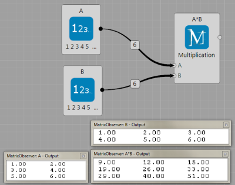
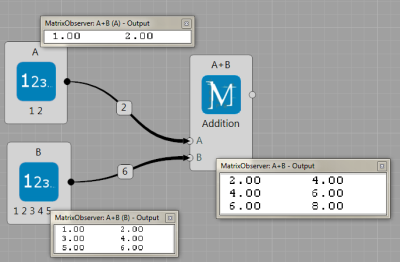
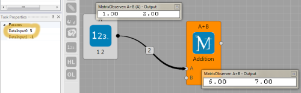
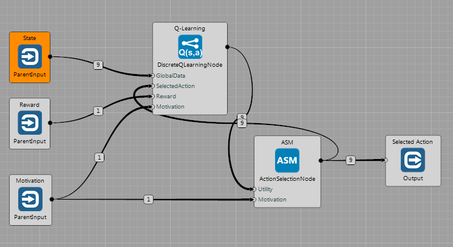

# Example brain files will be here


## Matrix node

Purpose of this node is to simplify vanilla matrix operations such as addtion or multiplication.

### List of features

 * The node allows multiplication or addition with different input sizes, so in addition to to matrix multiplication
$\mathbf{A} \cdot \mathbf{B}$ (where $\mathbf{A}$,$\mathbf{B}$ are matrices), it directly supports $\mathbf{v}^{\mathsf{T}} \cdot \mathbf{A}$ ($\mathbf{v}$ is vector), or $\mathbf{A} \cdot \mathbf{v}$, $\mathbf{v}^{\mathsf{T}} \cdot \mathbf{w}$, $\mathbf{v} \cdot \mathbf{w}^{\mathsf{T}}$, or $ c \cdot \mathbf{A}$.
 * For several opts (getRow, $c \cdot \mathbf{A}$), two input types are supported: 1) a memory block from another node; 2) user writen number in `ExecuteParams/DataInput` task property.
 * The node is a layer above the `MatrixAutoOps` class, so you can use it in your code.


### Operations

 * **Addition,Multiplication,Substraction,MultiplElemntWise** (two memBlock inputs, or one into A and set the DataInput0 parameter): If two inputs each of them can be matrix, or vector, or constat). Be careful about the coorect sizes/dimensions of the inputs, it does column/row-wise operation. If only input to the A, then it perforsm multuiplication with the value at DataInput.
 * **DotProd** (two memBlock inputs): performs $\\mathbf{v}^{\mathsf{T} \cdot \mathbf{w}}$. Again, be carful about the dimensions of your inputs.
 * **MinIndex, MaxIndex** (one mem block input): returns min/max index in the vector.
 * **GetCol,GetRow** (two memBlock inputs, or one into A and set the DataInput0 paramter): returns n-th column of the input. The n that defines column/row id can be DataInput0 or value in the memory block in the B-input.
 * **Minus** (one memBlock input): returns minus input block
 * **Normalize ** (one memBlock input): return normalized matrix A, Norm2 used in this case.
 * **Norm2** (one memBlock input): returns norm2 of the matrix A
 * **Exp, Abs, Log, Round, Floor, Ceil** (one memBlock input): returns Exp/Log/Abs/Floor/Round/Ceil of each element of the matrix A.


### Using as a node in Brain Simulator

Link to the live demos/examples
Link to the live demos/examples

Here are few representative examples how to use Matrix node, more can be found in the Sample Projects, where you can play with parameters and copy-past them directly into your projects.

* Two memory blocks that represents matrices are multiplied, below observers show what is inside the memory blocks.


* Two memory blocks that respresents a matrices and a vector are multiplied, below obserevers again show what is inside the memory blocks.


* Two memory blocks that respresents a matrices and a vector are added, However the algorithm cannot perform elemnt-wise addition because of the mem. block sizes, the number of columns of the matrix and the vector corespond. Thus the algorithm performs element-wise addtion for each row.


* If memory block plus a known constat should be performed, the matrix node allows user to insert the constat as DataInput0 (see orange circle).



### Using it in your C# code

You need create the Matrix object
``` csharp
MyMatrixAutoOps mat_operation;
```

In the `Init` part, you need to create an instance of the object and set-up the desired operations you will use:
``` csharp
mat_operation = new MyMatrixAutoOps(Owner, Matrix.MatOperation.Multiplication | Matrix.MatOperation.Addition, A);
```

Inside details such as, cublas, CPU, or kernels are hidden. So, you can directly multiply memory blocks `A` and `B` and save the result into memory the block `C`,
``` csharp
mat_operation.Run(Matrix.MatOperation.Multiplication, A, B, C);
```
or multiply `A` with number 10.4,

``` csharp
mat_operation.Run(Matrix.MatOperation.Multiplication, A, 10.4f, C);
```

Becuase the `Addition` operation was initlized too, the user can proceed,
``` csharp
mat_operation.Run(Matrix.MatOperation.Addition, A, B, C);
```

Complete code in the BS node will look like:
``` csharp
public class MyExecuteTask : MyTask<MyMatrixNode>
{
  private MyMatrixAutoOps mat_operation;

  public override void Init(int nGPU)
  {
    mat_operation = new MyMatrixAutoOps(Owner, Matrix.MatOperation.Multiplication | Matrix.MatOperation.Addition, Owner.A);
  }
  public override void Execute()
  {
    mat_operation.Run(Matrix.MatOperation.Multiplication, Owner.A, Owner.B, Owner.C);
    mat_operation.Run(Matrix.MatOperation.Multiplication, Owner.C, 10.3f, Owner.B);
    mat_operation.Run(Matrix.MatOperation.Addition, Owner.A, Owner.B, Owner.C);  // C = A+A*B*10.3
  }
}
```


## Image processing

Brain Simulator contains several image processing nodes and algorithms. So far, it includes gpu implementation of the SLIC algorithm [1].

The image processing nodes will be presented on the example of ball-tracking in the Breakout game.


### The method


First,  an  input  image  is  seg-mented  into  super-pixels  (SP)  using the SLIC  [1].   Second,  eachSP is connected with its neighbors and close-by SP are assigned into a same object id. Third, the attention energy ($E_a$) is estimated for  each  object.   Fourth,  features  are  estimated  for  the  object with  the  highest $E_a$ by  a  hierarchy  of  convolutions  and  fully-connected layers.  Fifth, the object features are clustered into a Visual Words [5] to constitute a Working Memory.


* ** Super-pixels pre-processing. **
 SLIC algorithm [1,2] was used to divide image into a set of super-pixels (sp). Important is that the algorithm is fast, each sp covers roughly uniform area, and concatenating correct sps will results in objects. It also assign descriptor to each super pixel based on its average color and its change in time.
The segmentation node is shown here. It requires number of segments (right side of the figure) as a paramter and the input image has to be squere.


* ** Join patches. **
Joining sp in the correct way should results in the objects. A graph of super-pixel conenctions is constitured. Each edge of the neighboring nodes is weighted based on the difference between the descriptor of edges and if the weight is larger $\tau$ than it conceive one object.


* ** Saccadic-like movement. **
Now how to go from one object to another is modeled. Each object is assigned with an attension score $E_{a}(o_i)$ that concatenates the fact that we want to focus on stuff that moves, but we always dont want to look only on a single object all the time. It is an energy-like function calculated for each object in this way: $E_{a}(o_i) = E_{time}(o_i) + \alpha E_{move}(o_i)$, where $E_{time}$ decreases in time and increases only if it was just chosen, $E_{move}$ is from the change in time descriptor.

* ** Representing the object. **
In the example file, the image patch is represented only by the raw pixels, richer version that is based on the prelearn features in the Breakout game scheme. In the richer version, a neuron network after the focuser output is added and the back-propagation algorithm is used to learn the network (Auto-encoder in this case) to represent thedata [4]. In this example, the netowork is created from two convolutional layers and one full-connected layers. The last layer is the vector representation of the object. This corresponds to the patch descriptor.

* ** Visual memory of objects. **
MyKMeansWM node stores all objects and where they are. The method is following. For the given focuser output, we compare it with the current state of the memory and if it is similar to an object, we update the object based on the given input data. If not, it creates the new object. The method can be seen as an on-line version of the popular K-Means clustering algorithm [5,6].


Overall, the final scheme for the vision part is implemented in BS as:


** References **

 [1] [Description of the SLIC method](http://ivrg.epfl.ch/research/superpixels)

 [2] [Carl Yuheng Ren, Ian Reid, gSLIC: a real-time implementation of SLIC superpixel
segmentation, Report with CUDA implementation, Technical report, 2011](http://www.robots.ox.ac.uk/~carl/papers/gSLIC_report.pdf)

 [3] [Code of gSLIC on GitHub](https://github.com/painnick/gSLIC)

 [4]  [Marc Aurelio Ranzato, Fu-Jie Huang, Y-Lan Boureau, Yann LeCun, Unsupervised Learning of Invariant Feature Hierarchies with Applications to Object Recognition, In CVPR, 2007](http://yann.lecun.com/exdb/publis/pdf/ranzato-cvpr-07.pdf)

 [5] [Josef Sivic, Andrew  Zisserman, Video Google: A Text Retrieval Approach to Object Matching in Videos, In ICCV, 2003](http://www.robots.ox.ac.uk/~vgg/publications/papers/sivic03.pdf)

 [6] [Christopher Bishop, Pattern Recognition and Machine Learning, 2007](http://research.microsoft.com/en-us/um/people/cmbishop/prml/)

## Discrete Q-Learning

There are three basic types of learning: supervised, unsupervised and Reinforcement Learning (RL), which learns from rewards. Well known type of model-free RL is called Q-Learning, which does not require model of the problem before-head. The agent controlled by the Q-Learning algorithm is able to learn solely by:

  * producing actions
  * observing new states
  * receiving rewards.

And **it learns how to obtain the reward and while avoiding the punishment** (negative reward).
The Q-Learning is named after the Q function, which computes Quantity of state-action combination: $\mathbf{Q} : \mathbf{S} \times \mathbf{A} \rightarrow \mathbb{R}$, where $\mathbf{S}$ is set of states and $\mathbf{A}$ set of actions. For each state, the $\mathbf{Q}$ tells the system *how good particular actions are*.

In the discrete case, the system operates in discrete time-steps and the $\mathbf{Q}$-values are stored directly in the look-up table/matrix. The system learns iteratively by updating the following [equation](https://en.wikipedia.org/wiki/Q-learning):


At each time step, the agent:

  * selects the action $a_t$ at the current state $s_t$ (by using the Action Selection Mechanism (ASM), see below)
  * executes the action $a_t$
  * observes new state $s_{t+1}$
  * receives the reward $R_{t+1}$
  * finds the utility of the best action in the new state: $max_a Q_t(s_{t+1},a)$
  * updates the $\mathbf{Q}$ value according to the equation above.  

We can see that the equation *spreads the reward one step back*. The learning is is configured by parameters $\alpha$ (learning rate) and $\gamma$ (how strongly is the reward spread back ~ how far in the future agent sees).  

Our discrete Q-Learning nodes use also **Eligibility trace**, which enables the system to update multiple $\mathbf{Q}$-values at [one time-step](http://webdocs.cs.ualberta.ca/~sutton/book/ebook/node78.html). This greatly speeds-up learning convergence. Such an improved algorithm is often called $\mathbf{Q(\lambda)}$. The parameter $\lambda$ defines how [strongly is current difference projected back](http://webdocs.cs.ualberta.ca/~sutton/book/ebook/node82.html). The higher the parameter, the faster the learning. But too high value can destabilize the learning.


### Discrete Q-Learning Node

The $\mathbf{Q(\lambda)}$ algorithm is implemented in the `DiscreteQLearningNode`. It receives **state description**, **reward(s)** and **action** that has been selected for execution. It **publishes vector of utilities** of all actions in the given state. Furthermore, these values are multiplied by the amount of motivation on the input.



The node expects positive values on the input. If these are not integers, they can be rescaled in the Node's configuration. The Q-matrix updates sizes of particular dimensions based on the input values that are fed into the node. Therefore the input data can be either variables or constants.

### Action Selection Method

The Q-Learning learns by interaction with the environment through own actions. Therefore it has to be able to weight between **exploration** of new states (searching for rewards) and **exploitation** of the knowledge. Here we use motivation-based $\epsilon-greedy$ [Action Selection Method](http://www.tokic.com/www/tokicm/publikationen/papers/KI2011.pdf) (ASM). The $\epsilon-greedy$ selects random action with $P=\epsilon$ and the best action (the highest utility) otherwise. The `ActionSelectionNode` (see above) implements motivation-based $\epsilon-greedy$ method, where $\epsilon = 1-motivation$. This means that: the higher motivation: the less randomization (the more important is to exploit the knowledge).

### HARM Node

TODO describe this


