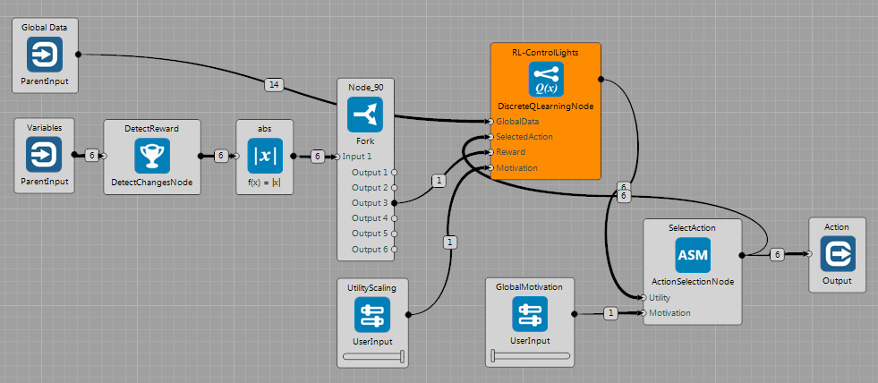
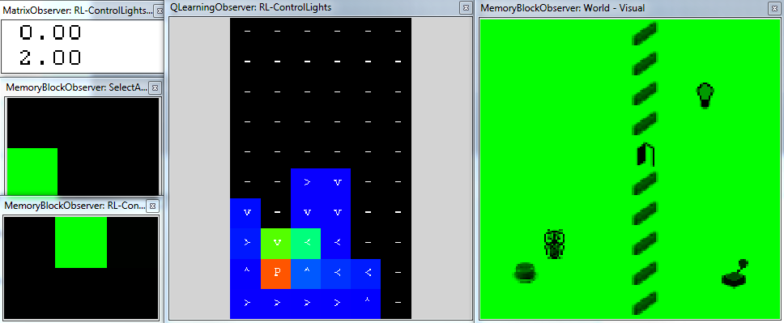
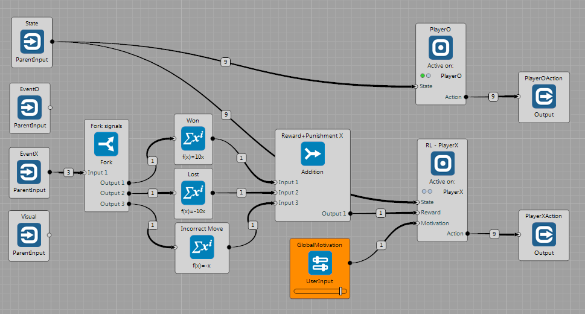
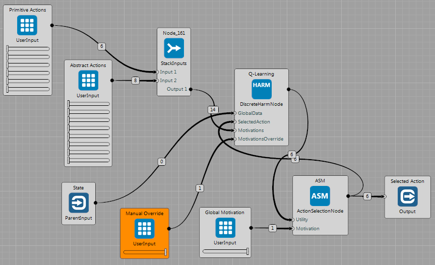
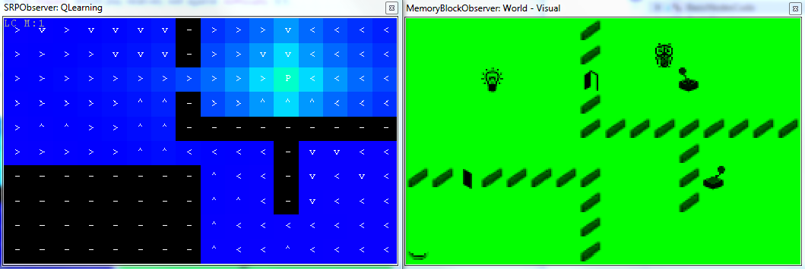
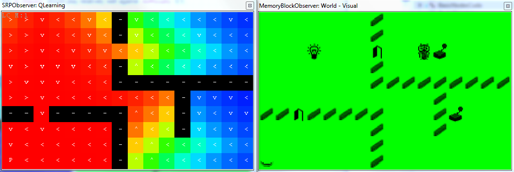

## Discrete Q-Learning

---
### Simple Q-Learning Example
Brain:  [QLearning-gridworld-oneReward.brain](https://github.com/GoodAI/BrainSimulatorSampleProjects/blob/master/DiscreteQLearning/QLearning-gridworld-oneReward.brain)

This brain shows basic use of `DiscreteQLearningNode` in the `GridWorld`. The Node receives state description as `GlobalData` (variables + constants) from the World. The reward is defined as a change of the state of the lights ($ values \in \lbrace 0, 1 \rbrace $). The nodes on the left detect changes of variables and select the one for the lights. In the current state, actions are chosen randomly - `GlobalMotivation` is set to 0. Utilities published by the `DiscreteQLearningNode` are multiplied by the `UtilityScaling` value.

The following figure shows state of the memory after about 400 simulation steps. It can be seen that the agent **received reward two times**. Also, the agent visited only left part of the World (including door), therefore the $\mathbf{Q}(s,a)$ matrix has currently dimensions only: $10 \times 6 ~states \times 6 ~actions$. The `QLearningObserver` shows:

  * graphical representation of the action with the highest utility.
  * color corresponds to the value of the utility of the best action (see the [Guides section](../guides/discreteqlearning.md)).

It can be seen that the Eligibility Trace wrote the $Q$ values on multiple positions back in time. Also we can see that the current strategy already leads towards pressing the switch, despite the fact that it is suboptimal.

---
### Composition of two Q-Learning Strategies

Brain: [QLearning-gridworld-twoRewards.brain](https://github.com/GoodAI/BrainSimulatorSampleProjects/blob/master/DiscreteQLearning/QLearning-gridworld-twoRewards.brain)

The example shows how two different strategies can be composed as described in the [Guides section](../guides/discreteqlearning.md#harmNode). The task is identical to the brain above, but there is one additional `DiscreteQLearningNode`, which learns different strategy - receives reward when controlling the door. By the `UtilityScaling` sliders it is possible to prioritize between these strategies.

---
### Q-Learning plays TicTacToe

Brain: [QLearning-tictactoe.brain](https://github.com/GoodAI/BrainSimulatorSampleProjects/blob/master/DiscreteQLearning/QLearning-tictactoe.brain)

The brain can be seen in the figure. The `TicTacToeWorld` only receives actions and sends events indicating whether:

  * the player won
  * the player lost
  * the last player's action was incorrect (position already occupied, take another action)

It has common output indicating state of the game. For each player there is a separate `Event` output and `Action` input. The world sends `Signal` which player should play at a given time step. Each player is placed in the `ConditionalGroup`, which runs the node only if the $signal \in \lbrace PlayerOSignal, PlayerXSignal \rbrace$ is raised.

Here, the PlayerO `ConditionalGroup` contains `TicTacToePlayerNode` and RL-PlayerX group contains `DiscreteQLearning` Node. The reward signal is defined as follows:

  * try to win
  * avoid losing
  * avoid incorrect moves with a lower importance

#### How to Use

In this case, the world is "*not passive*". In case that the `RL-PlayerX` produces only random actions it will receive  only punishments most of the time. The following approach works well:

  * Set the `Difficulty` parameter of the `TicTacToePlayerNode` to some lower value (e.g. 0.25~0.5)
  * Set the `GlobalMotivation` to some small value (around 0.5).
  * Test the learning convergence:
    * Set the `GlobalMotivation` to 1.0
    * Observe the output of the `Reward+Punishment X` Node in order to see how well the `RL-PlayerX` plays.
    * Around time step no. 150000, the `RL-PlayerX` should play relatively well against `Difficulty` 0.5 .

---
### Two Q-Learning Nodes play TicTacToe
Brain: [QLearning-tictactoe-twoNodes.brain](https://github.com/GoodAI/BrainSimulatorSampleProjects/blob/master/DiscreteQLearning/QLearning-tictactoe-twoNodes.brain)

The same task as in the previous example. But in this case, two Nodes learn to play TicTacToe against each other. User can alter the motivation and observe the effect on playing.

---
### HARM Node Examples

Brains: [HARM-gridworld-mapF.brain](https://github.com/GoodAI/BrainSimulatorSampleProjects/blob/master/DiscreteQLearning/HARM-gridworld-mapF.brain) and [HARM-gridworld-mapG.brain](https://github.com/GoodAI/BrainSimulatorSampleProjects/blob/master/DiscreteQLearning/HARM-gridworld-mapG.brain)

These examples show usage of the `DiscreteHarmNode`, see the [Guides section](../guides/discreteqlearning.md#harmNode) for more details.

The `GridWorld` contains an agent, walls and several controlled objects (2 doors and 1 light in this case) and switches which control them. The agent is allowed to use 6 primitive actions $\mathbf{A}=\lbrace Left, Right, Up, Down, Noop, Press \rbrace$. If the agent is on the same position as a switch and executes the $Press$ action, the corresponding switch and its controlled object (e.g. door) change the state. Note: since the `DridWorld` publishes state of each switch and its controlled object separately, the `DiscreteHarmNode` learns two identical strategies for each of these variables.

The following figures illustrate how to use the Node after it has already learned strategies:

  * `ManualOverride` slider is set to 1.0
  * User can choose which `Abstract Actions` should the agent follow by setting their motivation values.

In this case, the motivation is manually set **to turn on the light** - press a button in the left bottom corner.

Note that the `SRPObserver` can be used to show only **two selected dimensions** of a multi-dimensional $\mathbf{Q}(s,a)$ matrix. In this case, the X and Y variables are shown, the rest of dimensions is taken from the current state of the environment. The mark at each position depicts the *action with the maximum utility* value and the mark represents this action.

In the state that the door on the way are closed, the strategy leads first towards the switch that controls these door.

After opening the door, the strategy leads directly towards the switch that controls the lights (here, the `SRPObserver` shows different dimension of the matrix).

