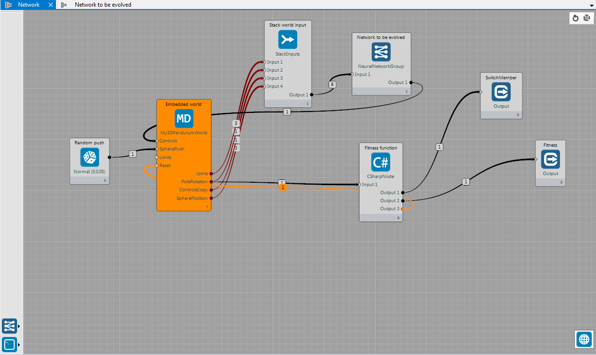
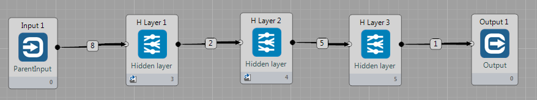
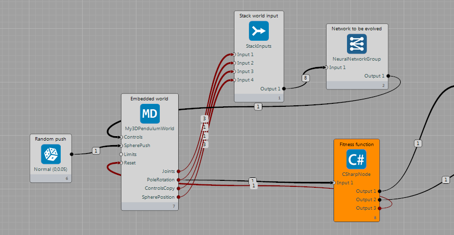
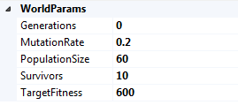
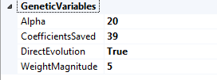

## Genetic Training World ##

This example describes how `GeneticTrainingWorld` is working. The whole example is available [here](https://github.com/GoodAI/BrainSimulatorSampleProjects/blob/master/Evolution/GeneticWorld3DPendulum.brainz). 

The `GeneticTrainingWorld` operates by hosting another world. This example focuses on training a neural network to balance a 3D pendulum.

The `GeneticTrainingWorld` takes two inputs from the network, a flag to switch members and an input of the fitness of a particular member of the population. Here, both of these signals come from the C# node (`CShaprNode`) which acts as the fitness function.

The Neural network in question is a small one composed of three hidden layers, each with a handful of nodes (2-5-1). The final layer is sized to the expected input for the pendulum world:

The outputs of `My3DPendulumWorld` are stacked (using `JoinNode`) up and pushed into the neural network, which computes a movement and sends it to the input for the PendulumWorld. In addition, the `PoleRotation` Output is fed as input into the C# node fitness function which connects to the inputs of the genetic training world and to the reset input of the `My3DPendulumWorld`.

The `GeneticTrainingWorld` itself maintains a population of network weights. Each timestep, it runs its selected genetic training task. These tasks may differ in their specific implementation, but perform broadly the same actions.

In each timestep, the genetic world runs a single generation of training which follows the algorithm:

1. For each population member *p* in *P*  
	1. Set the neural network weights to those of *p*
	2. While  the `SwitchMember` input == 0 
		- Run all of the nodes in a loop
	3. Record the value of the fitness input for this *p*
2. Order *P* by fitness
3. If a member of *P* has a low fittness
	- Perform genetic recombination
4. Next timestep

 
From this algorithm, we see that the user fitness function decides when to change members and what fitness they should be assigned. In the case of this example, the member is changed when the `poleRotation` is greater than 0.2, or less than -0.2. It also changes member when the network has balanced the pole for `TargetFitness` * 2 timesteps. This is part of the world’s parameters.
The user is given free reign to define their fitness functions to be as free or constricting as they desire.
 
## CoSyNE ##

CoSyNE is a method of genetically co-evolving neural network weights. Repopulation is performed by standard crossover and mutation, but also with a special permutation step where weights are permuted across members of the population to potentially migrate high scoring weights to other members to increase their fitness. Full details can be found in [1].

In addition to this weight permutation, CoSyNE gives the option of compressing the weight space via a Discrete Cosine Transform (DCT) and evolving only small number of these compressed coefficients.

Because the DCT is a computationally expensive operation if performed in a traditional manner, a cosine coefficient matrix M is pre-computed as described in [2] in order to simplify the problem to matrix multiplication. The CUDA cuBLAS library is used to perform these multiplications in an expedient manner. 
  

[1] Faustino J. Gomez, Jürgen Schmidhuber, Risto Miikkulainen: Accelerated Neural Evolution through Cooperatively Coevolved Synapses. Journal of Machine Learning Research 9: 937-965 (2008) ([full pdf](http://people.idsia.ch/~juergen/gomez08a.pdf))

[2] [http://www-rohan.sdsu.edu/doc/matlab/toolbox/images/transfo7.html](http://www-rohan.sdsu.edu/doc/matlab/toolbox/images/transfo7.html)
