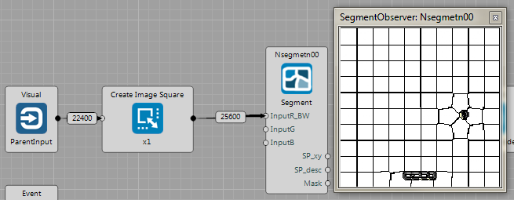
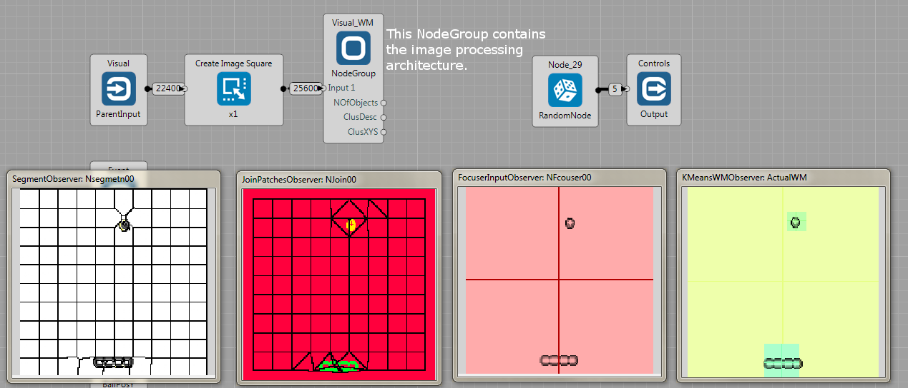
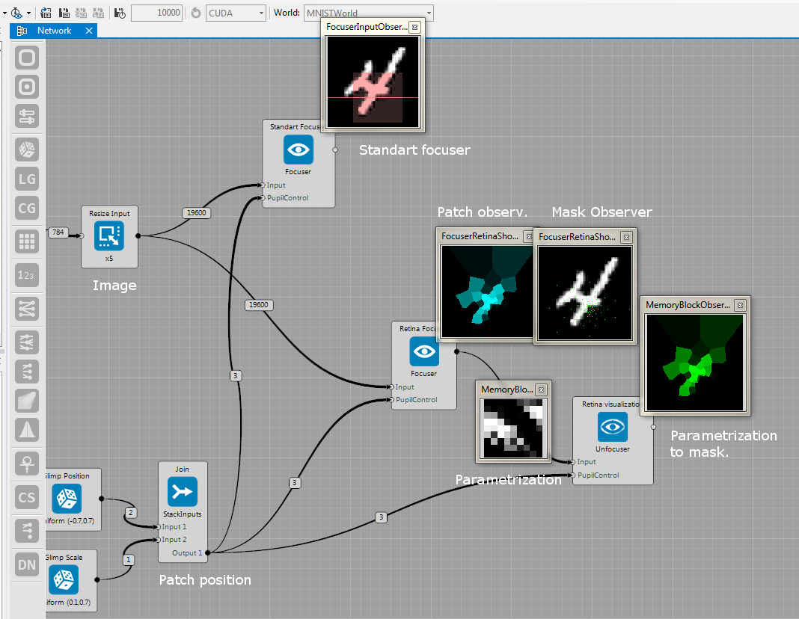

## Image Processing

These sample projects show several [examples](https://github.com/GoodAI/BrainSimulatorSampleProjects/tree/master/Vision) to perform [image processing](../guides/improc.md)

### Segmentation
Brain: [Vision/Vision_SLICsegmentation.brain](https://github.com/GoodAI/BrainSimulatorSampleProjects/blob/master/Vision/Vision_SLICsegmentation.brain)

The sample shows how to segment input image using the SLIC algorithm. Note that the input image is first re-sized to have a square shape, which is a requirement of the segmentation node. When one clicks on the observer, there is a `Operation/ObserverMode` property that yields to switch between different visualizations modes (such as segmentation borders, centers XYZ-color space etc.).

---

### Simple Image Pre-Processing

Brain: [Vision/Vision_segmentationForBreakout.brain](https://github.com/GoodAI/BrainSimulatorSampleProjects/blob/master/Vision/Vision_segmentationForBreakout.brain)

The sample project shows the pipeline for unsupervised discovery of the hypothesized objects. First, an input image is segmented into super-pixels (SP). Second, each SP is connected with its neighbors and close-by SP are assigned into a same object id. Third, the attention energy (Ea) is estimated for each object. Fourth, features are estimated as raw image patches. Fifth, the object features are clustered into a Visual Words to constitute a Working Memory.

Again, `Operation/ObserverMode` property of most of observers switches between visualization modes.

Details are described in [Guides/Image Processing](../guides/improc.md).

---

### Focuser
Brain: [Vision/focuserRetina.brain](https://github.com/GoodAI/BrainSimulatorSampleProjects/blob/master/Vision/focuserRetina.brain)

The brain file contains a simple example for cropping a part of the image. It shows the standard focuser that outputs a part of the image, given a position and scale.

In addition, the `Focuser` has a mode to work as retina transformation ([it is a modification of the method in this paper](http://papers.nips.cc/paper/4089-learning-to-combine-foveal-glimpses-with-a-third-order-boltzmann-machine.pdf)). In this case of retina transform, there is a higher resolution towards the given position, while the resolution decreases when being distant to the center.

---

### Sequential Drawing
Brain: [Vision/sequentialDrawing.brain](https://github.com/GoodAI/BrainSimulatorSampleProjects/blob/master/Vision/sequentialDrawing.brain)

In this sample project, the network takes a raw image and tries to reconstruct it over time. The structure is as follows: In time-step 0 the network gets the input and no target but the network generates some output (image on the left); in time-step 1 the network gets the previous output and again no target (its output is the middle image); in time-step 2, it again gets its own previous output as a new input (again middle image), but it gets the target too and thus the network can calculated deltas, propagate them and update weights. The example is provided with a small number of 10 MNIST images. More inspirations on how to use this architecture can be found at the [Marek's blog](http://blog.marekrosa.org/2015/09/another-goodai-milestone-attention_16.html).

