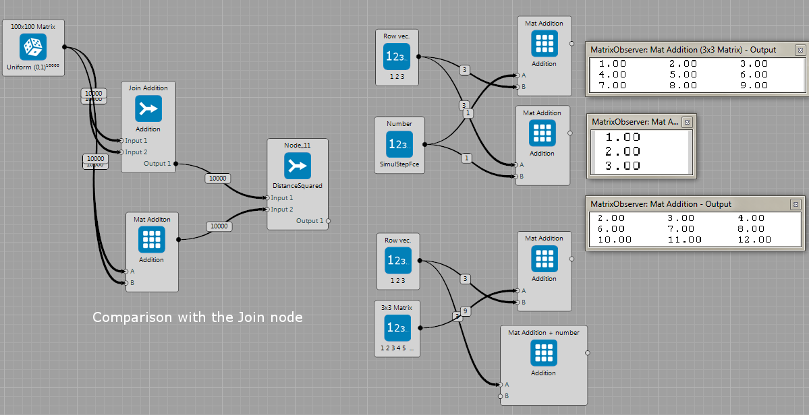
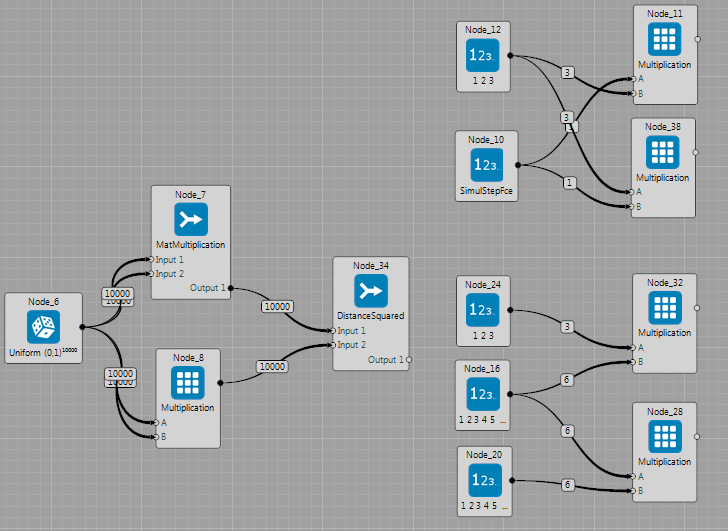
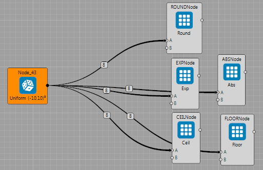
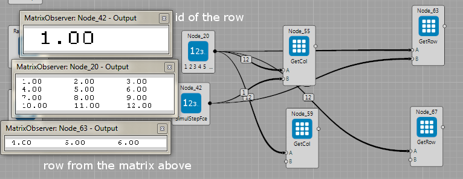

## Matrix Node

These sample projects show several [examples](https://github.com/GoodAI/BrainSimulatorSampleProjects/tree/master/Matrix) to perform [matrix operations](../guides/matrix.md).

### Addition

Brain: [Matrix/Matrix_Addition](https://github.com/GoodAI/BrainSimulatorSampleProjects/blob/master/Matrix/Matrix_Addition.brain)

Brain file with several examples of the addition operation.
It contains :

 * Summation of matrix and number. The number is defined as a memory block as well as `Params\DataInput0` parameter.
 * Row or column wise addition of vector and matrix.
 * Summation of two matrices. The `JoinNode` contains operation for addition of two matrices too. Thus, the example shows comparison of these two methods. Output of the `MatrixNode` and the `JoinNode` are compared in the new `JoinNode` using the `DistanceSquared` operation. The difference (visualized using the observer) is zero.

Note that dimensions (number of rows and columns) of all inputs must always make sense, thus the correct operation will performed.

---

### Multiplication

Brain: [Matrix/Matrix_Addition](https://github.com/GoodAI/BrainSimulatorSampleProjects/blob/master/Matrix/Matrix_Addition.brain)

Brain file with several multiplication examples. Again, note that dimension of inputs has to correspond to the desired operation with matrices. The sample project contains examples with:

 * Vector times number
 * Vector time matrix
 * Matrix times matrix. Again, the `JoinNode` contains operation for matrix multiplication too. The example shows comparison of these two methods. Output of the `MatrixNode` and the `JoinNode` are compared in the new `JoinNode` using the `DistanceSquared` operation. The difference (visualized using the observer) is zero.

---

### Log, Exp, Round

Brain: [Matrix/Matrix_Addition](https://github.com/GoodAI/BrainSimulatorSampleProjects/blob/master/Matrix/Matrix_LogExpRound.brain)

Examples with Round, Exp, Log operations on the matrix. Note that only one input is used in this case. The `MatrixNode` now applied desired function on that input MemoryBlock.

---

### Get Row / Column

Brain: [Matrix/Matrix_Addition](https://github.com/GoodAI/BrainSimulatorSampleProjects/blob/master/Matrix/Matrix_getRowCol.brain)

This brain file sample shows how to use the `MatrixNode` for getting the desired row or column of the matrix. The input is matrix and id of the row or the column (which row/column I want to get). The observers in the figure bellow show an example where we want to get row id ,,1'' (that is the second row because counting starts with 0). The matrix is shown in the middle observer. The result (node's output) is shown in the last observer.

