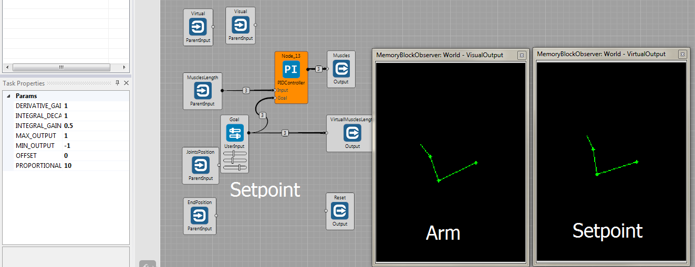
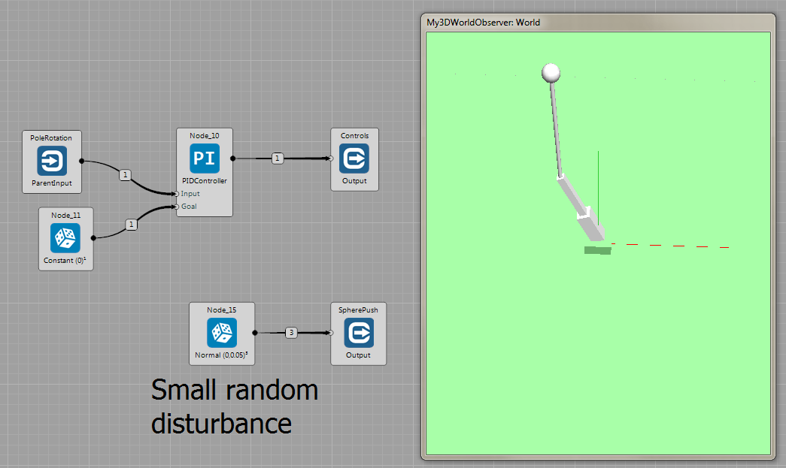
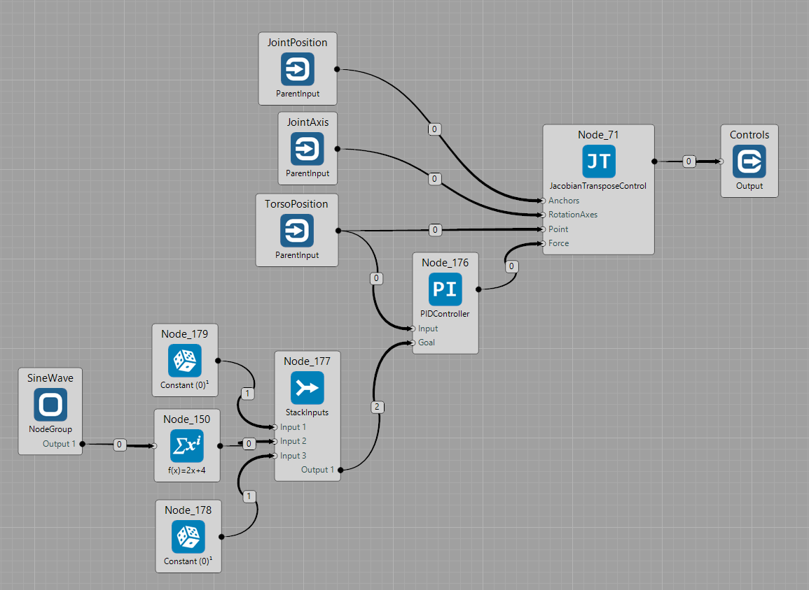

## Motor Control Examples ##

### PID Controller ###
[Arm reaching setpoint with PID controller](https://github.com/GoodAI/BrainSimulatorSampleProjects/blob/master/Motor/pid_arm_setpoint.brain). PID controller minimises error between user defined setpoint of arm's joint angles and current arm state.

---

[Balancing inverted pendulum with PID Controller](https://github.com/GoodAI/BrainSimulatorSampleProjects/blob/master/Motor/pid_pendulum.brain). PID controller manipulates rotation of the arm so as to keep the pole vertical.

### Jacobian Transpose Control ###

[Bipedal robot doing crunches](https://github.com/GoodAI/BrainSimulatorSampleProjects/blob/master/Motor/jtc_bipedal.brain). Setpoint of torso position is moved up and down following a sine wave. PID controller is then used to generate virtual force applied on torso, that would move it to current setpoint. Jacobian transpose control translates virtual force to set of torque for each joint.

