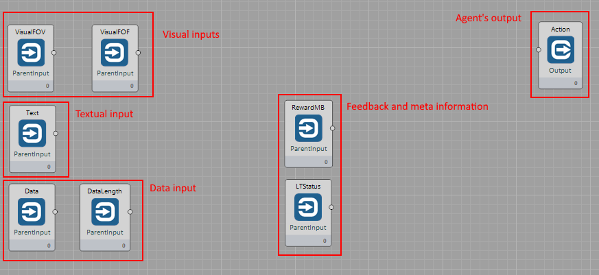
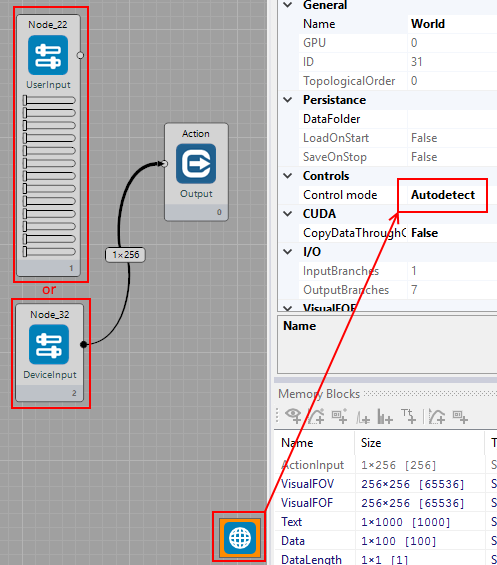

## School for AI

School for AI is a world within BrainSimulator which you can use for training and testing of your architectures. The school assumes that the training is structured into a curriculum, which is composed of individual learning tasks. A single learning task teaches or tests preferably a single new skill or ability.

The training can occur in a range of environments. We've prepared a basic 2D environment (RoguelikeWorld), an advanced 2D environment (ToyWorld), and a basic 3D environment (3D version of ToyWorld). A single curriculum can train the same architecture on multiple different environments.

### Basic concepts

The Agent is expected to experience different environments, each having different rules, School for AI makes this process easier by allowing the user to select, from the user interface, the environments and the order in which those environments appear.

#### School

The agent can be seen as attending a virtual school, where different types of exercises are presented to the Agent in order to teach it skills, in "School for AI", those exercises are referred to as "Learning Tasks". A learning task, for example, might have the purpose of teaching to the Agent the detection of shapes, this process would involve presenting different shapes to the Agent on different instances, those specific instances are referred to as "Training Units", a Learning Task consists of one or more Training Units. Lastly, a list of learning tasks compose what is referred to as "Curriculum".

#### Learning Task

A Learning Task can be seen as an exercise that is presented to the Agent in order to teach it to solve a specific type of problem

#### Training Unit

A Training Unit is a specific instance of the problem that a Learning Task represents and wants to teach the Agent to solve.

#### Curriculum

A curriculum is a composition of one or more Learning Tasks

### UI

To use School, start Brain Simulator and select "View->School for AI". Notice that this action will change your current world to School World and open a dedicated School window (see illustration below).   

The School window allows you to:

1. Specify the curriculum which your agent will be subjected to,
2. Control the simulation,
3. See what problem (learning task) is being run at the moment,
4. See the current progress of a learning task,
5. See what kind of input data your agent is receiving,
6. See runtime statistics.

You will notice that School has a dedicated world, SchoolWorld. It gets selected automatically when you open the School for AI window. As long as you intend to work with School, you should keep this world selected. 
The SchoolWorld provides a fixed set of inputs for your agent and receives a fixed set of outputs from it. This way you can design a single agent architecture that will be subject to training in School, using different learning tasks. 

The inputs the world provides to your agent are:

1. Two visual inputs (Field of View - large and low-res; Field of Focus - small and hi-res),
2. A textual input,
3. A data input with a size indication,
4. Feedback through the Reward memory block,
5. Meta-information through the LTStatus memory block (progress in the learning task, number of the learning task).

The output signals the world expects from your agent are all contained within a single memory block, Actions. 
Your agent should connect to the Action memory block using a connection of size 13 at least. The individual actions are:

1. Movement commands (forward, backward, left, right, rotate left, rotate right), 
2. Field of Focus movement commands (fof left, right, up, down), 
3. Interaction commands (interact, use, pickup/drop).

To ease human interaction with the environments in School, you can also connect the DeviceInput node to the inputs of the world. In such case, relevant keystrokes (e.g. WSAD) are converted to 1s and sent to the environment. If you intend to switch between the DeviceInput node and other means of providing input, you should keep the World's control mode at "Autodetect".

### Architecture overview

#### SchoolWorld

School is implemented as a MyWorld node called SchoolWorld. This node has a control window associated, accessible from the menu "View->School for AI". The SchoolWorld is special - it can spawn new worlds during runtime. This property is used for creating the training and testing environments for the agent (RoguelikeWorld, TetrisWorld, ToyWorld, etc.)

SchoolWorld acts as a point of contact for your architecture. It provides input to the architecture and receives outputs from it. It then redirects this I/O to the world that was spawned for the current learning task from the curriculum. Besides acting as an intermediate, School also collects statistics of the training and controls the simulation. For instance, School pauses the simulation if the trained architecture fails to pass a learning task.

#### World Adapters

Any world can be connected to SchoolWorld. To connect a world, you need to write a WorldAdapter class. You don't need to register the new adapter anywhere, inheriting the IWorldAdapter interface is enough.

#### Switching Worlds

