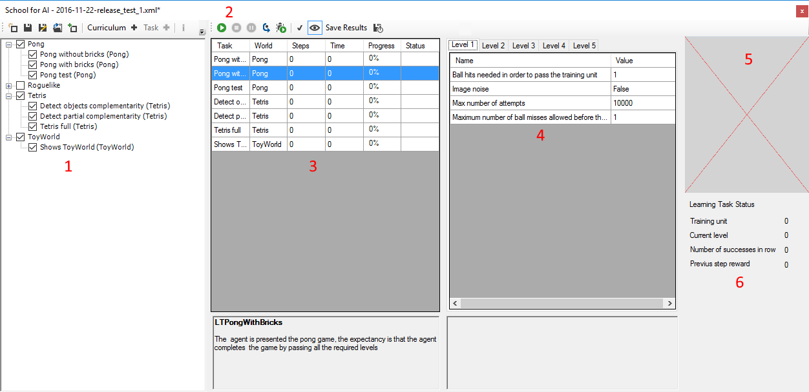

## School for AI

This section shows usage of School for AI (or School for short) in Brain Simulator.

### UI

To use the School, start Brain Simulator and select "View->School for AI". Notice that this action will change your current world to School World and open a dedicated School window (see illustration below).   

The School window allows you to:

1. Specify the curriculum which you agent will be subjected to,
2. Control the simulation
3. See what problem (learning task) is being solved at the moment
4. See what the current level of the learning task is
5. See what kind of input data your agent is receiving
6. See runtime statistics

### Basic concepts

#### School

#### Learning Task

#### Training Unit

#### Curriculum

### Architecture overview

#### School World

#### World Adapters

#### Switching Worlds

