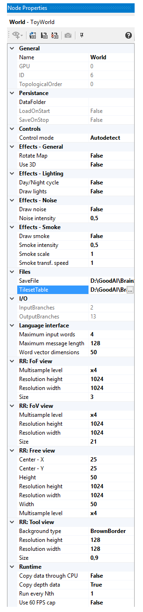

# Toy World

On this page, expect to find both general user overview and a more concrete programmer's insights into what the `Toy World` is and how it is designed, should you want to tinker and bend the code to your liking.

The Toy World is a simple customizable continuous 2D (optionally 3D) environment. It was designed as a test bed for general artificial intelligence agents; the possible complexity of the world enables the experimenters to gradually increase the requirements for the agent's skills. The design decisions were mostly made in favour of rapid world prototyping and easy data transfer between your application and the Toy World core. 

## User part
### World design
The world comprises a grid of voxels; each voxel is a collection of cells, where each cell belongs to a different `Tile Layer` (that is: the world is a cuboid). Every cell can have up to one `Tile` -- this is the actual item that the objects interact with and that gets drawn.

Next to Tile Layers, there are `Object Layers` that span multiple Tile Layers. All `Characters` (objects with movement and custom actions) belong to a specific Object Layer and compute collisions and actions only against other objects or tiles in the corresponding Tile Layers.
          

There are generally different types of Tile Layers, e.g.:

 * a passable layer (grass, gravel, bricks, etc.),
 * an impassable layer (walls, stones, etc.),
 * an impassable interactable layer (doors, switches, etc.), and so on. 

This allows an easier interaction with objects based on the type of layer they are in.

The world has a few interesting tiles and properties ready from the start, e.g.:

 * a day/night cycle that darkens the screen in the evening,
 * a summer/winter cycle that periodically covers tiles in snow or
 * tree tiles that periodically spawn objects near them (apples, pears, pinecones, etc.) that the characters can eat or transport around.

### Character design
`Characters` in Toy World are "a dynamic version of tiles" in that they can move in the environment independently from the grid. They follow the usual physics-based rules like collision with impassable objects (tiles and other characters that share an interval in their layers).

A special class of a character is the `Avatar`. In addition to movement, Avatars can interact with the environment (open doors, pickup objects, eat fruit, etc.). This is the entity in the Toy World core that your application's artificial brain can connect and send inputs to. This means that you can independently control any number of avatars in the world using any means you desire (a neural network-based learning system or e.g. a simple behavioral tree for lesser avatars).

Each avatar not only accepts inputs based on which it behaves in the environment, but also produces a set of outputs. These are e.g.:

 * some pieces of information about the avatar's current energy and tiredness levels,
 * the contents of its inventory, 
 * the field of view (a generally large but low-res visible area around them) and 
 * a field of focus (a high-res small area within the field of view).

### Brain simulator settings
You can conveniently setup the Toy World using the Brain Simulator's world properties. You can control all global effects and Render Requests' resolutions (more on these in the [render architecture section](#render)).  

The not necessarily self-explanatory properties include:

 
 * Effects           
     * Rotate map - should the map be rotated and the avatar remain facing up at all times?
     * Use 3D - this is a provisional mode where the scene gets rendered from the avatar's point of view instead. Note that this disables the use of field of focus.
     * Day/Night cycle - if enabled, the scene will periodically fade into darkness.
     * Draw lights - this is a provisional feature. If enabled, all characters except avatars will emanate light with attenuation based on their current speed of movement. At a later stage, this should be used for ambient purposes (and be 
     completely re-done).
     * Draw noise - A random gaussian noise will be added to each of the RGB channels. The variance of the distribution is influenced by the "Noise intensity" property.
     * Draw smoke - The are between impassable objects will be filled by a fog. This is based on the continuous 3D perlin noise. You can specify the intensity (fog "thickness"), scale (the steepness of the gradient) and the speed of fog's flow.

 * Language interface
     * TODO

 * Render requests
     * Multisample level - the amount of subpixels per pixel
     * Resolution -
     * Size/Width/Height - 

 * Runtime
     * Copy data through CPU -
     * Copy depth data

RR settings -- resolution, multisampling, size
2D/3D, effects -- smoke, noise, lights, day/night
CPU/GPU copying of drawn image (CPU is a backup version)
Optionally copy depth data too (reduces performance)

screen z BS, popisky

gosdfjgplksgf 

## Programmer's part
### World architecture
How the atlas works (overview)
How to define your own map using Tiled (.tmx) so it works in ToyWorld
How to add a new tile/layer in .tmx so that it works in ToyWorld
How to add a new character in .tmx so that it works in ToyWorld
         
         
### API
(ThreadSafe)GameController, avatarControllers, render requests and settings, avatar actions/controls

### Render architecture
All drawing logic is managed by a **Renderer** (inheritors of `RendererBase`). Its purpose is to fulfil separate rendering requirements -- Render Requests (avatar's field of view/focus, full map view, only tool, etc.) -- and to provide specific implementations with access to render resources (textures, geometry, effect shaders and render targets).

Users can ask for any amount of **Render Requests** (RRs) (inheritors of `RenderRequestBase`); each displays the scene differently. For instance the **Avatar Render Requests** (inheritors of `AvatarRRBase`) extend the behaviour by being tied to a specific avatar, the camera follows him around, it draws his inventory etc. There are several notable RRs ready for use -- it is enough to simply get them through a game controller, set them up and collect and process the drawn image after every step.

Every render request uses **Painters** to do the actual drawing (inheritors of `PainterBase`). What you see as settings for the render request are actually settings for the individual painters. Render targets and some fields are shared by all painters of a render request. Every painter has its own copy of objects it needs (shaders, etc.), if it requires specific settings. There are no connections between different render requests, they are totally independent and have their very own set of framebuffers to draw onto and to copy from.  

Please note that ToyWorld uses OpenGL for rendering the scene and on some systems, the interoperability between OpenGL and CUDA is not working correctly. In such case, set the world's property "CopyDataThroughCPU" to true, save your project and restart Brain Simulator. 

### Game logic
Toy World setup -- create/load world, create and configure render requests, do the Loop
  
Update loop: 

1. Game objects receive inputs
2. World updates
3. Desired action resolution -- physics of movement, etc.
4. Draw the render requests -- update the render requests' states, render game objects, effects and gather the scene's image
5. Wait to reach 16.666 ms each frame

Everything is SYNCHRONOUS -- no overlapping between frames/parts of frame (except within Draw -- the render requests are independent)

