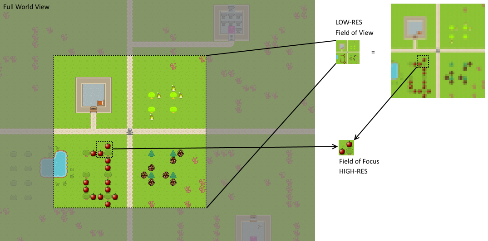
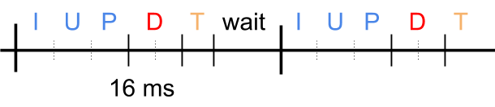

# Toy World

On this page, expect to find both general user overview and a more concrete programmer's insights into what the `Toy World` is and how it is designed, should you want to tinker and bend the code to your liking.

The Toy World was designed as a test bed for general artificial intelligence agents; the possible complexity of the world enables the experimenters to gradually increase the requirements for the agent's skills. The design decisions were mostly made in favour of rapid world prototyping and easy data transfer between your application and the Toy World core. 

## User part
### World design
Grid, cells, tiles, tile and object layers
Rooms, day/night, trees/apple spawning,...

### Character design
Inputs (movement, actions), outputs (fov, fof, stats)
Interactions (use/open/eat, pickup)
Physics (collisions with characters and impassable tiles -- depends on height intervals)
Allows multiple avatars to be independently controlled within one world

### Brain simulator settings
RR settings -- resolution, multisampling, size
2D/3D, effects -- smoke, noise, lights, day/night
CPU/GPU copying of drawn image (CPU is a backup version)
Optionally copy depth data too (reduces performance)

## Programmer's part
### World architecture
Tile/layer/character types
Creation using Tiled (.tmx)

         
### API
(ThreadSafe)GameController, avatarControllers, render requests and settings, avatar actions/controls

### Render architecture
All drawing logic is managed by a **Renderer** (inheritors of `RendererBase`). Its purpose is to fulfil separate rendering requirements -- Render Requests (avatar's field of view/focus, full map view, only tool, etc.) -- and to provide specific implementations with access to render resources (textures, geometry, effect shaders and render targets).

Users can ask for any amount of **Render Requests** (RRs) (inheritors of `RenderRequestBase`); each displays the scene differently. For instance the **Avatar Render Requests** (inheritors of `AvatarRRBase`) extend the behaviour by being tied to a specific avatar, the camera follows him around, it draws his inventory etc. There are several notable RRs ready for use -- it is enough to simply get them through a game controller, set them up and collect and process the drawn image after every step.

Every render request uses **Painters** to do the actual drawing (inheritors of `PainterBase`). What you see as settings for the render request are actually settings for the individual painters. Render targets and some fields are shared by all painters of a render request. Every painter has its own copy of objects it needs (shaders, etc.), if it requires specific settings. There are no connections between different render requests, they are totally independent and have their very own set of framebuffers to draw onto and to copy from.  

Please note that ToyWorld uses OpenGL for rendering the scene and on some systems, the interoperability between OpenGL and CUDA is not working correctly. In such case, set the world's property "CopyDataThroughCPU" to true, save your project and restart Brain Simulator. 

### Game logic
Toy World setup -- create/load world, create and configure render requests, do the Loop
  
Update loop: 
1. Game objects receive inputs
2. World updates
3. Desired action resolution -- physics of movement, etc.
4. Draw the render requests -- update the render requests' states, render game objects, effects and gather the scene's image
5. Wait to reach 16.666 ms each frame

Everything is SYNCHRONOUS -- no overlapping between frames/parts of frame (except within Draw -- the render requests are independent)

 

