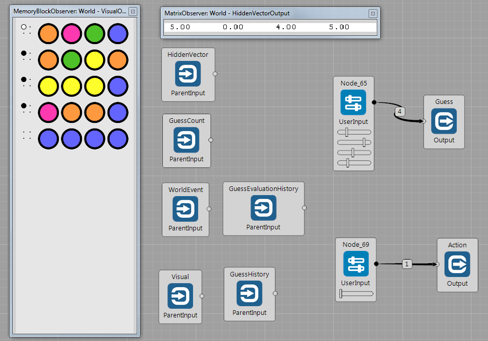

## Selected Brain Simulator Worlds

This section shows usage of selected Worlds in the Brain Simulator.

### AnimationPredictionWorld

This world is suitable for testing algorithms that should predict the sequences. The world reads the dataset in in the folowing format: `C:\absolutePath\NamePrefix_00000.png`. Then the world reads the ordered sequence and presents it to the output.

Compared to the `ImageDatasetWorld`, this also supports reloading the dataset online in the `Reload images` Task. This way, it is possible to change the sequence at runtime, without stopping or even pausing the simulation. 

The dataset used in this example can be downloaded [here](../guides/img_examples/SwitchTest.zip).

### AssociativeNetworkWorld

Brain: [TextProcessing.brain](https://github.com/GoodAI/BrainSimulatorSampleProjects/blob/master/TextProcessing/AssociativeNetworkWorldExample.brain)

The `AssociativeNetworkWorld` serves for loading concepts and relations either from a file or typed in by the user. The information needs to be stored in an ASCII file in the comma separated format:
**Concept1**, **Concept2**, **Relation**, **relation strength** on each line. An example of a concept might be *"elephant"* or *"mouse"* and a relation might be *"is bigger than"*. The strength of this relation might be for example 0.9, because there sometimes exist really big mice in our world. We cam save this relation into a file as:

`elephant, mouse, is bigger than, 0.9`   

and load in into the Brain Simulator using `AssociativeNetworkWorld`. The world takes one line at a time from the input file and presents the information in the respective input blocks. The text is encoded as a vector of integers so we can perform various operations on it using existing nodes.

There are also two special nodes designed for manipulation with the text:

`TextInputNode`    can output a user defined constant string or can be used for translating an incoming number into a text vector.
`TextObserverNode` has it's own observer which can visualize the incoming strings or can be used for saving the strings into a file.

Utilization of the world and both nodes mentioned above is depicted in the image below. The row vectors (of strings encoded as integers) for both concepts and the relation are transposed and concatenated together with the information about the strength of the relation (which is beforehand translated into a text vector via `TextInputNode`). The resulting column text vector is transposed back into a row text vector and fed in the `TextObserverNode` for the purpose of visualization. The window of the custom observer of this node can be seen in the bottom of the image.

Second utilization of the `TextInputNode` is depicted in the second image. Three such nodes output three different strings as text vectors which are subsequently stacked together and visualized by the `TextObserverNode`. Notice the second input into this node (a vector of real numbers between 0 and 1) which determines the brightness of each line.  

### MastermindWorld

This world is an environment for playing the [Mastermind](https://en.wikipedia.org/wiki/Mastermind_(board_game)) game.

The simplest way to begin playing the Mastermind game is by choosing MasterminWorld as your current world and connecting a UserInput node to the GuessInput node of the world. 

Note that there is also an ActionInput node - if you send it a 0 as input, the world processes your guess. If you send it a 1, the world ignores your guess and waits until you again send 0 as input. This is useful when you have a brain to train and want it to think several steps before submitting a guess to the world.

The game environment is configurable. The user can choose:
 
  * the number of colors available to the game,
  * the number of elements in the guessed vector,
  * the number of guess attempts.
 
 Apart from visual output, the world also provides a structured data output that contains the history of the guesses the agent has made so far and the history of evaluations of these guesses.
 
 Note that the visual output uses colors. To visualize it properly, set the Coloring Method of the Visual block's observer to *RGB*.

### 2DAgentWorld

Simple 2D world where the agent continually moves in 8 directions. The goal is to reach the target. Target is placed on a randomly generated position in the space. If the target is reached, the (reward) signal is set to output and new position of target is generated.

 
### TetrisWorld

This world is an environment for playing the [Tetris](https://en.wikipedia.org/wiki/Tetris) game.

The available controls are "do nothing", "move left", "move right", "move down", "rotate left" and "rotate right". You can choose whether you want to specify the actions through a binary vector of length 6 or by a single number, whose value equals the wanted action .

You can change the difficulty of the game through world's parameters. You can change the number of almost full lines at the beginning of the game, you can change the speed of the game and you can change how quickly the levels of the game progress.

 
 Apart from visual output, the world also provides a structured data output that contains information about the state of the area where bricks fall, about the score, level and the upcoming brick.
 
 Note that the visual output uses colors. To visualize it properly, set the Coloring Method of the Visual block's observer to *RGB*.

### TwoPlayerPongWorld

This world is very similar to the CustomPongWorld, with two exceptions:

1. the world contains two paddles for two players
2. the world does not contain any bricks

 
 The world offers two sets of controls and also two sets of structured data that describe the environment, one set for each of the players. The two sets of data differ because they adopt the perspective of the corresponding player.