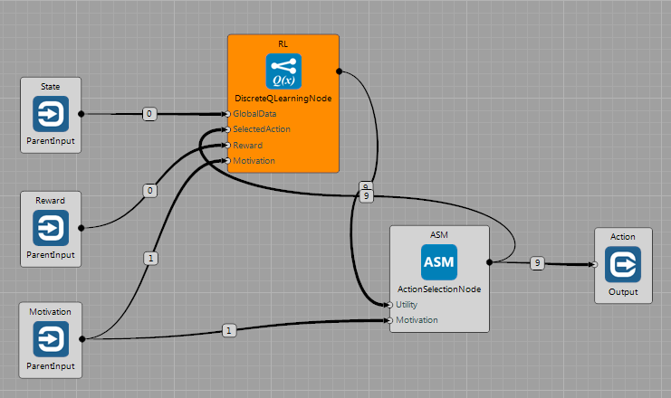
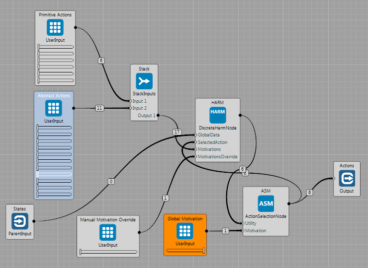

### Discrete Q-Learning Node

The $\mathbf{Q(\lambda)}$ algorithm is implemented in the `DiscreteQLearningNode`. It receives **state description**, **reward(s)** and **action** that has been selected for execution. It **publishes vector of utilities** of all actions in the given state. Furthermore, these values are multiplied by the amount of motivation on the input.

The node expects positive values on the input. If these are not integers, they can be rescaled in the Node's configuration. The Q-matrix updates sizes of particular dimensions based on the input values that are fed into the node. Therefore the input data can be either variables or constants. For more information, see the documentation of the node.

#### When to use it
If the problem:

 * **Is discrete:** such as `TicTacToeWorld` or `GridWorld`. The discrete Q-Learning will have problems with learning in worlds, such as `CustomPongWorld`. Possible solution can be in discretization of the problem (see the `Input Rescale Size` parameter).
 * **Has reasonable dimensionality:** The node stores Q-Value matrix containing all state-action combinations that have been visited. The matrix is allocated dynamically, but if the agent encounters too many world states (and/or has too many actions) the memory requirements can grow too fast.
 * **Fulfills the MDP property:** A world fulfilling the [Markov Decision Process](https://en.wikipedia.org/wiki/Markov_decision_process) is such a world, where transition to the next state $s_{t+1}$ depends *only* on the current state $s_t$ and action taken by the agent $a_t$.

### Action Selection Method Node

The Q-Learning learns by interaction with the environment through own actions. Therefore it has to be able to weight between **exploration** of new states (searching for rewards) and **exploitation** of the knowledge. Here we use motivation-based $\epsilon-greedy$ [Action Selection Method](http://www.tokic.com/www/tokicm/publikationen/papers/KI2011.pdf) (ASM). The $\epsilon-greedy$ selects random action with $P=\epsilon$ and the best action (the highest utility) otherwise. The `ActionSelectionNode` (see above) implements motivation-based $\epsilon-greedy$ method, where $\epsilon = 1-motivation$. This means that: the higher motivation: the less randomization (the more important is to exploit the knowledge).

#### How to use it

Supposed to be used mainly with the `DiscreteQLearningNode` or `DiscreteHarmNode` for selecting actions based on utility values and the motivation. Recommended use case is the following:

 * **Start learning** with small (preferably zero) motivation (the system explores)
 * Optionally **increase the motivation** (system will tend 'wander around reward source(s)' more)
 * **Use the system** (motivation is high ~ exploitation is high). If the behavior is not sufficient, continue with exploration.

### Discrete HARM Node

The `DiscreteHarmNode` implements algorithm loosely inspired by the [Hierarchy Abstractions Reinforcements Motivations](http://citeseerx.ist.psu.edu/viewdoc/summary?doi=10.1.1.227.3381) architecture. It uses multiple Q-Learning engines/Stochastic Return Predictors (SRPs). In this implementation, the SRPs are created on line and only level of 1 of hierarchy is allowed.

Each SRP is composed of:

 * Pointers to part of decision space (subset of child variables and child actions)
 * Q-Learning with own memory
 * Source of motivation with own dynamics
 * Pointer to own source of reward

The output of the `DiscreteHarmNode` is vector of utilities for all primitive actions in a given state. Utility of each primitive action is composed of utilities of all parent SRPs. This means that ***all SRPs vote what to do, and the strength of their vote*** is given by:

  * their current motivation
  * current distance from their goal.

The  principle can be seen in the following figure. On the left: composition of strategies from two SRPs  with the same motivation. On the right: SRP for the goal on the right has higher motivation ([source](https://www.dropbox.com/s/30vq3ipduc9ghd5/jvitkudt2011.pdf?dl=0)). This defines what strategy will the agent use based on current motivations and position in the state space.

Similarly to the `DiscreteQLearningNode`, the operation has two consecutive phases:

 * **Learning:** all SRPs learn (update own Q-Values) in parallel
 * **Generating utilities of primitive actions:** for each action, sum utilities produced by all parent SRPs.

#### Main Principle of Work

Here is simiplified sequence showing how the arhictecture works. It starts with no SRPs and no motivations at the beginning:

  * Compute utilities of primitive actions and publish them
  * ASM selects and applies action
  * If some new variable changed, do **subspacing**:
    * Create new SRP
    * Add only variables that changed often recently
    * Add only actions that were used often recently
    * Define **reward** for this SRP as a **change of this variable**
  * Perform variable removing for all SRPs:
    * Drop variables that did not change often before receiving the reward
  * Perform action adding
    * If actino has been executed abd the SRP obtained the reward, add the action

The following animation shows example of operation of the `DiscreteHarmNode` in the `GridWorld`. The agent can do 6 primitive actions ($\mathbf{A}$ *= {Left,Right,Up,Down,Noop,Press}*) and has already discovered 6 own abilities. For each of them it created own decision space, these are:

  * move in two directions (X and Y axis)
  * control light 1
  * open door 1
  * control door 2
  * control light 2

The corresponding brain is depicted above. Here, the motivation of `ASM` is set to 1, so the agent selects actions based on utilities produced by the `DiscreteHarmNode`. We can see how the agent systematically trains the SRPs based on the dynamics of the motivation sources.  

#### How to Use the Node

In order to use the `DiscreteHarmNode`, connect state inputs, `ActionSelectionNode` and two inputs for manual override of inner motivations. If the value of `MotivationsOverride` input is above 0.5, the SRPs will not use own sources of motivations. Instead, the motivations can be set manually.

Typical use case of the `DiscreteHarmNode` is as follows:

  * Set the `MotivationsOverride` to 0, set the `GlobalMotivation` of ASM to zero
  * Let the system run to explore the state space and
    * create SRPs
    * learn different strategies in these SRPs
  * Optionally increase the `GlobalMotivation` for focusing nearer to the reward sources
  * Test the learning convergence by setting the `GlobalMotivation` to 1
  * If the system is learned well, you can use its capabilities by setting `MotivationsOverride`

#### When to Use the Node

On top of suggestions for use of the `DiscreteQLearningNode` it needs to be considered that the `DiscreteHarmNode` ***learns how to change the environment***. So it is best to use it in static environments, where the only change is caused by the agent's actions.

In case that there is changing variable that is not influenced by the agent, the HARM still assumes that the agent caused the cahnge. It creates SRP which *"learns the behavior"*. But the good property of this system is that:

  * If the variable changes often, the corresponding SRP is *"successfull"* often and therefore has constantly low motivation. This means that **does not vote** what to **strongly**.
  * If the variable does not change often, there is not much rewards and average utility values are low. Therefore the corresponding SRP still **does not vote strongly** too, even if the motivation is constantly high.
