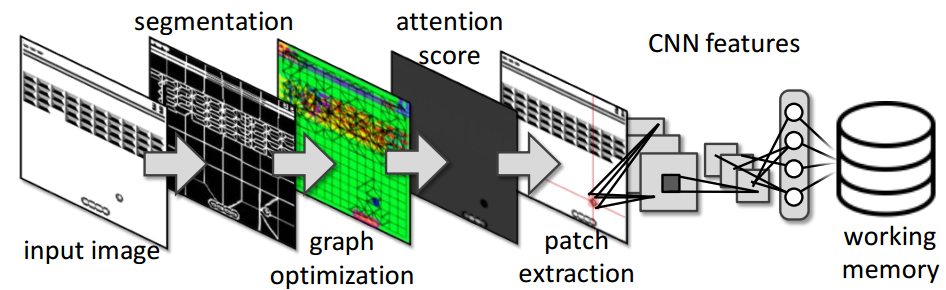
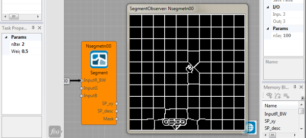
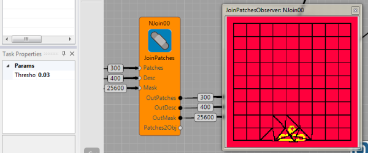
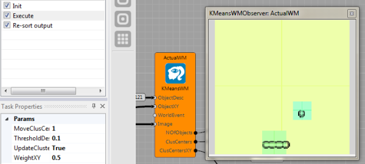

# Image processing

Brain Simulator contains several image processing nodes and algorithms. So far, it includes gpu implementation of the SLIC algorithm [1], basic algorithm for joining super-pixels, image patch selection algorithm, and on-line k-means clustering that constitute a working memory in our example.

The image processing nodes will be presented on the example of ball-tracking in the Breakout game.

## The method

The algorithm drives its attention from one object to another and it works in the following way. First,  an  input  image  is  segmented  into  super-pixels  (SP)  using the SLIC [1] method.   Second,  each SP is connected with its neighbors and close-by SP are assigned into a same object id. Third, the attention energy ($E_a$) is estimated for  each  object.   Fourth,  features  are  estimated  for  the  object with  the  highest $E_a$ by  a  hierarchy  of  convolutions  and  fully-connected layers.  Fifth, the object features are clustered into a Visual Words [5] to constitute a Working Memory. 

### Super-pixels pre-processing
 SLIC algorithm [1,2] was used to divide image into a set of super-pixels (SP). Important is that the algorithm is fast, each SP covers roughly uniform area. It also assign a simple descriptor to each super pixel based on its average color and its change in time.
The segmentation node in the image below. It requires the number of segments parameter (right side of the figure) and the input image has to be square.

### Join patches
Concatenating super-pixels results in objects. The goal is to find which neighborhood super-pixels correspond to the same object and which do not. Thus, a graph of super-pixel connections is created. Each edge (that connects vicinity super-pixels) is weighted based on the difference between the super-pixels descriptor and if the weight is larger than a Params/Threshold super-pixels that are connected by the edge belongs to the same object.

### Saccadic-like movement
The algorithm now decides on which object it focuses its attention. Thus, each object has an attention value $E_{a}(o_i)$ that concatenates the fact that we want to focus on stuff that moves, but we want to focus on different objects too. It is an energy-like function calculated for each object in this way: $E_{a}(o_i) = E_{time}(o_i) + \alpha E_{move}(o_i)$, where $E_{time}$ decreases in time and increases only if it was just chosen, $E_{move}$ is from the change in time descriptor.

### Representing the object
In the example file, the image patch is represented only by the raw pixels, richer version that is based on the pre-learn features is in the Breakout game scheme. In the richer version, the focuser output (image patch) is used as an input into a following neural network and the back-propagation algorithm is used to learn the network (Auto-encoder in this case) to represent the data [4]. In this example, the network is created from two convolutional layers and one full-connected layers. The last layer is a vector representation of the object.

### Visual memory of objects
MyKMeansWM node clusters all objects, the method is following. For the given focuser output, we compare it with the current state of the memory and if it is similar to an object, we update the object based on the given input data. If not, it creates the new object. The method can be seen as an on-line version of the popular K-Means clustering algorithm [5,6].

Overall, the final scheme for the vision part is implemented in Brain Simulator as:

## References

 [1] [Description of the SLIC method](http://ivrg.epfl.ch/research/superpixels)

 [2] [Carl Yuheng Ren, Ian Reid, gSLIC: a real-time implementation of SLIC superpixel
segmentation, Report with CUDA implementation, Technical report, 2011](http://www.robots.ox.ac.uk/~carl/papers/gSLIC_report.pdf)

 [3] [Code of gSLIC on GitHub](https://github.com/painnick/gSLIC)

 [4]  [Marc Aurelio Ranzato, Fu-Jie Huang, Y-Lan Boureau, Yann LeCun, Unsupervised Learning of Invariant Feature Hierarchies with Applications to Object Recognition, In CVPR, 2007](http://yann.lecun.com/exdb/publis/pdf/ranzato-cvpr-07.pdf)

 [5] [Josef Sivic, Andrew  Zisserman, Video Google: A Text Retrieval Approach to Object Matching in Videos, In ICCV, 2003](http://www.robots.ox.ac.uk/~vgg/publications/papers/sivic03.pdf)

 [6] [Christopher Bishop, Pattern Recognition and Machine Learning, 2007](http://research.microsoft.com/en-us/um/people/cmbishop/prml/)
