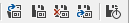

# Persistence

You can activate automatic data loading after the simulation is started and you can also enable automatic data saving just before the simulation is stopped. There are global (project scope) and local (node scope) switches for that. Global tools are on the main toolbar and local ones are in the node property window.

##Easy saving of temporary data
When you just want to save or load a project with its temporal data then use the .brainz file format so that the Brain Simulator takes all the trained data from the temporary storage folder of the current project and packs it to a zip file along with the project file. "Save data on stop" needs to be enabled for individual nodes or globally before any state data is saved. If there is no data in the temporary storage folder, only the project is saved in the zipped file.

Then when you load the .brainz file the reverse process occurs and you get your project and temporary data back (if there is any...). 

## Data Loading
Selected nodes will be loaded with available data after the first simulation step is done. In this step, only `OneShot` tasks are executed. Then, all persistable memory blocks will be overridden with loaded data.

There are three different places from where the data can be loaded:

* **Temporal location** - automatic, cannot be changed by the user, dependent on the project name and node id. On Windows, it is `%userprofile%\AppData\Local\Temp\bs_temporal`
* **Local data folder** - node property `DataFolder` (each node has its own place for data)
* **Global data folder** - for all nodes, can be set through global loading option. Can be obtained by exporting (globally). Also requires the .state file to be present for it to work properly.

The locations are used in this particular order so for example when there is any temporal data for a node it is loaded even if there is a local data folder or even global data folder set up. 
Despite that, some error may appear during the loading process. For example, structure gets changed and the size of memory block as well. In such case, Brain Simulator will not load affected memory block and will throw a warning into the Console.

## Data Saving
If you activate data saving (global or local), selected nodes will be saved to the temporal location after the last simulation step is finished. In such way, you can start from user defined data and continue from the last stored simulation data. Any other behavior should be possible by combining save and load switches.

In order to store data outside of your Brain Simulator you have to export it from the temporal location. This is done globally (Main toolbar button. Creates the .state file as well.). All available data will be exported to user defined location and you can filter it out if needed. You can get to the right data using node IDs that are a part of the folder names.

Be aware that temporal data will outlive Brain Simulator and nodes with enabled loading will always load temporal data of the last finished simulation if available. If you want to start with different data then you have to clear temporal data first. There is a local (node only) and a global tool (whole project) for that.

After stopping the simulation, data is saved in the following order:

* If **Save Data on Stop** is active for node -- node data is saved to temporary location
* If **Global Save on Stop** is active -- all data are saved to temporary location

## Controls
There are two toolbar groups for controlling which data to save and load. Global and node specific. 

###Global

Part of the [simulation controls toolbar](../ui.md#simulation-controls)

*  **Global Load on Start** - toggle, loads data from specified folder if there are no temporal data and no local data folder set up or the local data folder is empty.
*  **Global Save on Stop** - toggle, saves data to temporary location
*  **Clear Stored Network State** - deletes all data in temporary location
*  **Export Stored Network State** - exports data from temporary location to a specified folder (creates .state file as well)
*  **Autosave During Simulation each X steps** - toggle, saves data to temporary location each X steps

###Node specific

*  **Load Data on Startup** - toggle, loads data from specified folder if no temporal data is found 
*  **Save Data on Stop** - toggle, saves data to temporary location
*  **Clear Saved Data** - deletes data in temporary location

## Validation
There are some mandatory validation rules applied when loading is enabled. Also, every node will inform you from which location the data is loaded and if the data will be saved at the end. Watch this information as it may change between simulations (1st simulation = user defined location, 2nd simulation = temporal location). Finally, when global loading is enabled, Brain Simulator will not check if there are data available for all nodes because different projects can vary a lot. It only throws a warning at the loading time when something is missing.
