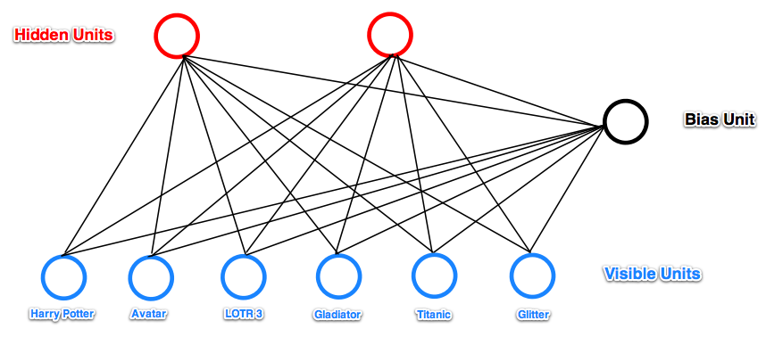
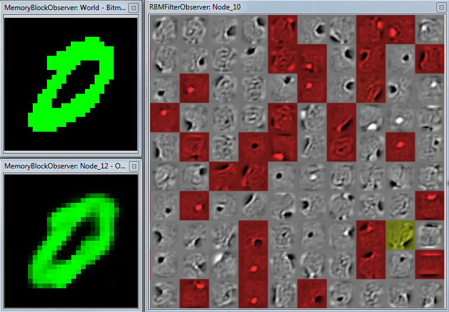

# Restricted Boltzmann Machine

[Restricted Boltzmann Machine](https://en.wikipedia.org/wiki/Restricted_Boltzmann_machine) (**RBM**) is a stochastic autoencoder that can serve as feature encoder and/or decoder.

One of its uses is initialization of weights of a neural network prior to its actual training via stochastic gradient descent (SGD), using e.g. back-propagation for (fine) tuning.

When used like this, RBMs are stacked on top of each other to form a [deep belief network](https://en.wikipedia.org/wiki/Deep_belief_network) (DBN).

This is why RBM in Brain Simulator is built upon the classic neural network hidden layer. RBM layer inherits its whole functionality and thus can be used as both autoencoder and as a part of any neural network.

---
## Model

RBM is a two-layer neural network.

The two layers are fully connected to each other, there are no inner connections inside the layers.

The input layer is also called **visible** layer, the output layer is **hidden**.

Visible layer is typically bigger than the hidden layer, since the visible layer represents input and reconstructions while the hidden layer neurons correspond to *features* of the input.

For more details and a nice high-level example, see [Introduction to RBMs](http://blog.echen.me/2011/07/18/introduction-to-restricted-boltzmann-machines/) by Edwin Chen.

More mathematically precise overview and introduction is available in chapter two of [Hinton's paper on training RBMs](https://www.cs.toronto.edu/~hinton/absps/guideTR.pdf).

---
## Algorithms

### Training and filters

Training is done using the k-step Contrastive Divergence algorithm, first proposed by [Hinton](http://www.cs.toronto.edu/~fritz/absps/nccd.pdf).  

In the Brain Simulator implementation, training is done in the `RBM Learning` task.

During training, RBM automatically adjusts its weights based on what it perceives. The **weights to one output neuron correspond to one feature** of the input entity.

Why? Imagine that the input is a 20x20px grayscale image. The input layer has thus 20x20 = 400 neurons.  
Now there are also 400 weights leading to that output neuron; each weight originates in one particular input pixel. And each weight has also a value that determines strength of that connection.

Thus, we can draw these weights as an image too – and each pixel will show us how much the input pixel contributes to activation of this output neuron!

This is why we talk about *filters* and why we can (and should) represent the weights (the filters) as images.

Above is an example of filters learned on the full MNIST dataset. There are 100 hidden neurons and thus hundred visible filters. The red and yellow overlay is an activation mask. The more red, the more activated the neuron is (consequently, black-and-white neurons aren't activated at all or are activated marginally).

### Reconstruction

Remember that weights leading to each output neuron correspond to one filter, since it is a mapping from the input (e.g. from an actual image) to one value, the activation of the output neuron.

Thus, when reconstructing, the value of the output neuron means how much the input correponds to the neuron's filter. If the neuron is active, we can say that the input has a certain feature corresponding to this neuron.

Use `RBM Reconstruction` task of the `RBMGroup` (see below).

---
## RBM Group

Any Brain Simulator network that uses RBM layers must be created under the `RBMGroup` node.

The group itself handles proper flow of data inside the network as long as it is in the RBM mode (doing of the two RBM tasks).

The other possibility is to use various types of SGD available in the group, since the group itself is a descendant of the Neural Network group. You can switch between the modes during runtime.

### Parameters

One important thing to note is that RBMs are rather volatile and even small changes in parameters can result in huge differences in performance and behaviour.

Parameters on the left are specific to **tasks**, not to the node itself. Thus, parameters of `RBM Learning` and `RBM Reconstruction` (these are the two possible RBM tasks) are completely different instances of the same concept, meaning that changing `CurrentLayerIndex` in one won't change it in the other task.

---
#### Learning parameters

The learning parameters should be self-explanatory. For their more detailed comparison and discussion about optimal settings, see [Hinton's paper](https://www.cs.toronto.edu/~hinton/absps/guideTR.pdf "A Practical Guide to Training Restricted Boltzmann Machines") on this topic.

In our experience, it generally works well to work with a low learning rate (at most 0.01). However, this might not be true in all cases (but it, so far, has been).

#### Layer indexing

Layers are indexed from 0 (zero) including.

First layer is always of type `RBMInputLayer` and its index is 0.

All other layers are `RBMLayer` and their indices can range from 1 to `total number of layers` excluding.

In **Learning** mode, the `CurrentLayerIndex` parameter is the index of the visible layer.  
Let's say we have three layers: one input layer and two RBM layers. If we set `CurrentLayerIndex` to 0, we will learn weights between input layer (layer 0) and first RBM layer (layer 1).  
We can set `CurrentLayerIndex` to 1 and learn weights between the second layer pair.  
We can't set the index parameter to any other value.

---

In **Reconstruction** mode, we can either start our sampling on the input layer and then the index says to which layer should we continue before returning back.

We can also start sampling on any other layer (by changing `Reconstruction source` from `INPUT` to `HIDDEN`). In that case, we start at layer specified by index parameter and go all the way back to the input layer and then again forward to the specified layer.

---
#### Activation parameters

In RBM, each neuron is assigned a probability of being activated. RBM can work with these probabilities or use random activations to either fully activate the neuron (set its output to 1) or to turn it off (0).

Learning in RBM is based on random activations which theoretically results in good generalization of the model. Random activations can be turned on and off during both training and reconstruction.

`RandomVisible` and `RandomHidden` properties obviously determine whether the currently visible and hidden layer will be randomly activated.

`RandomPrevious` enables or disables random activations of all other layers, i.e. those layers who currently aren't visible or hidden. Thus, this settings only takes effect when there are three or more layers present and we are not working with the first two layers.

Additionally, the `SigmoidSteepness` parameter is the $\lambda$ parameter in the sigmoid function:  
$\sigma(x) = \frac{1}{1+ e^{-x * \lambda}}$

Sigmoid function is used to compute the probability of activation of a given neuron after summing its inputs.

#### Node parameters

The parameters described above are specific to RBM tasks. The RBM group itself has parameters (by default to the right). However, these parameters are derived from the `NeuralNetwork` group and only take effect when a task unrelated to RBM is active.

Note that this applies to the `Dropout` group parameter as well. RBM layers do have dropout too, but it's a layer-specific parameter (see below). The group `Dropout` parameter has no effect during RBM tasks.

---
## RBM layer

RBM layer is built upon the hidden layer from neural network. The `RBMInputLayer` is the same except it has no weights and number of neurons is automatically determined from its input.

RBM layer features a `RBMFilterObserver` that enables you to visualize the learned filters. Click here to add it:

### Parameters

The only really important parameters are `Neurons`, which unsurprisingly determines number of neurons in the layer and `Dropout`, which sets the dropout rate. Note that dropout rate of `0.2` means that `20%` of neurons will be dropped out.

`ActivationFunction` parameter is only used in non-RBM tasks.

---
## Examples

There is an [example tutorial](../examples/rbm.md) as well as a [brain file](https://github.com/GoodAI/BrainSimulatorSampleProjects/blob/master/RBM/RBM_MNIST.brain) with a two-layer RBM trained on the MNIST dataset.

Additionally, an animated image of visualized filters when learning RBM on MNIST from scratch is available (*warning - 100 MB file*) [here](https://www.dropbox.com/s/yyy0so4d2mwl7f4/rbm.gif?dl=0).
