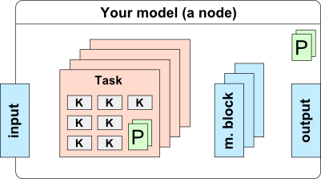
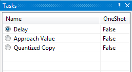

## Framework Basics

From your model point of view, you are representing a node in a kind of graph superstructure. The outer system does not need to know how exactly is your model structured if you don’t need to expose it. On the other hand, you will be separated from the outer system almost completely. On the next figure, there is the structure of a model you are going to follow:



Basically, you will organize your kernels into a set of **tasks**. Every task should aggregate a sub-step of your model (i.e. init stage, reward stage, etc.). Additionally, you can define a set of **parameters** both, for the task and for the node itself. Finally, your model will need a place to store the data, so you can define a number of **memory blocks** and set the size of these according to defined parameters. During execution, every memory block is allocated on host and on one or more devices (depends on how many GPUs you have). You are able to access the host memory from CPU code and pass device memory to kernels. Also, you have some limited control of memory transfers, as you can instruct the system to sync the content of the memory block in the task specific CPU code.

## Custom Node Implementation
For creating a node, you will generally derive the `GoodAI.Core.Nodes.MyWorkingNode` class. See the following snippet for details:

``` csharp

/// <author>Your Name</author>
/// <status>Working</status>
/// <summary>Short description</summary>
/// <description>Longer description</description>
[YAXSerializeAs(“Neurons”)]
public class MyTestingNode : MyWorkingNode
{
    //Node properties
    [MyBrowsable, Category(“Structure”)] //these attributes are for the property grid
    [YAXSerializableField(DefaultValue = 2), YAXElementFor(“Structure”)] //these are for XML serializer
    public int InputsPerNeuron { get; set; }

    [MyBrowsable, Category(“Structure”)]
    [YAXSerializableField(DefaultValue = 100), YAXElementFor(“Structure”)]
    public int NeuronsCount { get; set; }

    [MyBrowsable, Category(“Structure”), ReadOnly(true)]
    public int SynapseCount { get; set; } //not editable in UI, not serialized

    //Memory Blocks
    [MyInputBlock(0)]
    public MyMemoryBlock<float> FirstInput
    {
        get { return GetInput(0); }
    }

    [MyInputBlock(1)]
    public MyMemoryBlock<float> SecondInput
    {
        get { return GetInput(1); }
    }

    [MyOutputBlock(0)]
    public MyMemoryBlock<float> Output
    {
        get { return GetOutput(0); }
        set { SetOutput(0, value); }
    }

    public MyMemoryBlock<float> Threshold { get; private set; }
    public MyMemoryBlock<int> SynapseTo { get; private set; } //any struct may be used for a memory block type

    //Tasks
    public MyInitTask InitNeurons { get; private set; }
    public MyNeuronTask EvaluateNeurons { get; private set; }
    public MySynapseTask EvaluateSynapses { get; private set; }  //these are your classes

    public MyTestingNode() { }  //parameterless constructor

    //Memory blocks size rules
    public override void UpdateMemoryBlocks()
    {
        Threshold.Count = NeuronsCount;
        SynapseCount = NeuronsCount * InputsPerNeuron;
        SynapseTo.Count = SynapseCount;
        SynapseTo.ColumnHint = NeuronsCount;
    }

    //Validation rules
    public override void Validate(MyValidator validator)
    {
        base.Validate(validator);
        validator.AssertWarning(NeuronsCount == OutputSize, this, “Number of neurons should be equal to output size”);
    }

    public override string Description{
        get {
            if (NeuronsCount > 1000){
                return "f(x) = x ⊕ x"
            } else {
                return "f(x) = \u03c0(x)"
            }
        }
    }
}
```
As you can see, the implementation relies heavily on annotations (the C# attributes). You will use them on many places to inform the system how to handle your data/classes etc..

You should write "node comment" (the triple slash comment) before each of your nodes and keep its information up to date, as you will work on your node. These information are shown in the Brain Simulator UI in the Configure Node Selection view and in the Node Help view. You can format this comment using html tags.

Please notice several details in the implementation:

### Annotations
For **Node and Task**, you can use the following annotations:

* `MyObsolete(ReplacedBy=typeof(MyBetterNode))` - shows obsolete info in UI
* `MyNodeInfo(FixedOutput=false)` -
* `MyTaskInfo(OneShot=false, Order=0, Disabled=false)`
    - `OneShot=true` - Task will run only in first step of simulation
    - `Order=100` - For ordering the task in node. Tasks in lower number are earlier.
    - `Disabled=true` - Task will be disabled by default
* `YAXSerializeAs("Text")` - this will be used for serialization to XML

For **Tasks**, you can use the following annotations as well:

* `Description("Text")` - used in node task list as a task's name (task's class name is used when not specified)

For **Node and Task properties**, you can use the following annotations:

* `MyBrowsable` - property will appear in UI
* `MyPersistable` - makes property persistable, see [persistence](guides/persistence.md)
* `MyUnmanaged` - Brain Simulator will not take care of memory block's memory managing
* `Category("Text")` - used in UI in the Properties view as the name of a collapsible category group
* `DisplayName("Text")` - used in UI instead of the property name; if omitted, the property name will be shown
* `Description("Text")` - detailed description for UI, showed in the Properties view tooltip for the selected property and in the Node/World Help
* `ReadOnly(true)` - makes property read-only (ReadOnly(false) is default)
* `YAXSerializableField(DefaultValue=1)` - used for XML (de)serialization; DefaultValue is used as default value for the property, and when no value is detected during the deserialization
* ```YAXElementFor("Text")``` - used as a group name for grouping the properties inside of the XML file
* ```YAXCustomSerializer(typeof(MyPathSerializer))]``` - used for saving file/folder paths. This annotation converts the path to relative on save

There is one more annotation just for the **Task**:

* `MyTaskGroup("GroupName")` - adds task to the task group (see [below](model.md#task-group))

### Memory blocks
Memory blocks are defined by MyMemoryBlock<T> type property. If you want your MemoryBlock to be I/O (i.e. visible in the UI and connectible to the other nodes), you must annotate them with `MyInputBlock(x)` or `MyOutputBlock(x)` where x is the number of input or output. For convenient use, you should also implement the **get** and **set** methods for them. This is really easy as the only thing you have to do is

``` csharp
[MyOutputBlock(0)]
public MyMemoryBlock<float> Results
{
    get { return GetOutput(0); }
    set { SetOutput(0, value); }
}
```

Note that first argument of `GetOutput` and `SetOutput` must correspond with the number in annotation.

Your memory blocks must be declared as shown. Do not use arrays or lists of them. It’s not supported yet.

The **size of the memory block** is defined as: sizeof(item) * itemsCount. itemsCount needs to be set via `MyMemoryBlock.Count` property. Sizes of your memory blocks are usually dependent on parameters defined above. Put these rules into the `MyNode.UpdateMemoryBlocks()` method. This method is called before each simulation run and can be also called manually from UI.

**You must not write any data into input blocks or set their Count!** However, you can write any data to other (i.e. YOUR) memory blocks.

Each memory block is divided into **Host** and **Device** part. Host corresponds to data on CPU, while Device corresponds to data on GPU. You can access only corresponding parts in your code (i.e. Host part in C# code; Device part in CUDA kernels). The data passed into the input memory block are on the Device by default, if you want to use them in a CPU computation (i.e. use the memoryBlock.Host array), you need to copy them to the Host first with the method `SafeCopyToHost()`, then execute the calculation, fill the output memory blocks and copy these back to the Device with `SafeCopyToDevice()` method.

#### Useful MyMemoryBlock methods

* `SafeCopyToDevice()`, `SafeCopyToDevice(int offset, int length)` - copies Host data to Device data (all / with given offset and length)
* `SafeCopyToHost()`, `SafeCopyToHost(int offset, int length)` - copies Device data to Host data (all / with given offset and length)
* `CopyFromMemoryBlock(MyMemoryBlock<T> source, int srcOffset, int destOffset, int length)`  - copies data (Device) FROM given memory block to this one
* `CopyToMemoryBlock(MyMemoryBlock<T> dest, int srcOffset, int destOffset, int length)` - copies data (Device) from this block TO another one
* `GetSize()` - size of memory block in bytes
* `Fill(value)` - fills entire memory block (Host and Device) with given value - works with `float`, `int`, `uint`, `bool` and `byte[]` values
* `GetBytes(byte[] destBuffer)` - returns memory block data (Device=Host)

#### Dynamic memory blocks

Memory blocks marked with the DynamicBlockAttribute become dynamic, allowing the node creator to reallocate the memory block to a different size with a call to the block's Reallocate(int count) method. The system will try to reallocate both the host and device memory and if it's successful, it will copy the data from the original memory block over to the new one. Overflowing data is cropped, missing data is zero-filled.

Dynamic connections are marked with a white outline.

It is possible to use dynamic output blocks, but only nodes that have dynamic input blocks will be able to accept the connections.

**Warning: it is possible to create a loop of dynamic blocks leading to a cascade of reallocations. Take care when using dynamic blocks as node outputs.**

### Validation
If some other conditions must be fulfilled for the correct execution of your node, put them in the `MyNode.Validate()` method. If you want to omit validation completely (not a good idea), just override that method.

If you want to apply some validations, remember, that you should call MyWorkingNode's Validate method prior to doing that (as you can see in Node example earlier in the text).

**MyValidator's methods you can call** are:

* `AssertInfo(bool, MyNode, string)`
* `AssertWarning(bool, MyNode, string)`
* `AssertError(bool, MyNode, string)`

Each of them takes 3 arguments. Bool value (this should be condition, you are testing for) which - when false - triggers sending the INFO/WARNING/ERROR level message to console in the UI and potentially (in case of ERROR message) does not allow the simulation to start.

You can also directly send messages by calling `AddInfo(MyNode, string)`, `AddWarning()` or `AddError()` methods.


### Tasks
You must implement your own class for every task you need (see below).
Order of tasks in the source file will be preserved during the execution of your node. As a rule of thumb: **do not implement constructor with parameters and do not instantiate any memory block or task!** Your class will be analysed for you and all necessary instantiations and allocations will be done automatically at the right time .

#### Task Implementation

For every custom task of your node, you have to implement the following class derived from the `GoodAI.Core.Task.MyTask` class. See the following code for details:

``` csharp
[Description(“Initialize neurons”), MyTaskInfo(OneShot = true)]
public class MyInitTask : MyTask<MyTestingNode>
{
    //Task specific parameters
    [MyBrowsable, Category(“Params”)]
    [YAXSerializableField(DefaultValue = 1.5f)]
    public float TH_INIT { get; set; }
    [MyBrowsable, Category(“Params”)]
    [YAXSerializableField(DefaultValue = 0.2f)]
    public float AP_INIT { get; set; }

    public MyInitTask() { } //parameterless constructor

    private MyCudaKernel m_kernel; //put kernels here
    private MyCudaKernel m_additionalKernel;

    //Kernel initialization
    public override void Init(int nGPU)
    {
        m_kernel = MyKernelFactory.Instance.Kernel(nGPU, “InitNeuronsKernel”);
        m_additionalKernel = MyKernelFactory.Instance.Kernel(nGPU, “SomeKernelFile”, “AdditionalKernel”);
    }

    //Task execution
    public override void Execute()
    {
        m_kernel.SetConstantVariable(“D_TH_INIT”, TH_INIT); //pass constants to your kernel in this way
        m_kernel.SetConstantVariable(“D_AP_INIT”, AP_INIT);
        m_kernel.SetConstantVariable(“D_INPUT_S_PER_N”, Owner.InputsPerNeuron); //you can pass node parameters as well

        m_kernel.SetupExecution(Owner.NeuronsCount); //this will setup thread dimensions (or you can set it on the kernel itself)

        //Kernel execution
        m_kernel.Run(
            Owner.Threshold,
            Owner.ActionPotential,
            Owner.NeuronsCount //you can fill in any parameter including your memory blocks which will be translated into proper pointers
        );

        //For additional kernels, use these methods
        m_additionalKernel.SetConstantVariable(“D_INPUT_S_PER_N”, Owner.InputsPerNeuron);

        m_additionalKernel.SetupExecution(Owner.NeuronsCount);

        m_additionalKernel.Run(
            Owner.Threshold,
            Owner.NeuronsCount
        );
    }
}
```

Notice this:

* There is the same option of creating task parameters, as for the parent node. Please consider the place where you are putting them. The node parameters should reflect the structure of the node (i.e. only parameters, which affect the memory block sizes should be in nodes). The task parameters should affect the task execution and should be changeable during the simulation runtime.
* You can have as many kernels defined as you wish.
Kernel initialization must be placed inside the `MyTask.Init()` method to assure that they will be created on the proper GPU. (This might get changed in the future and only the name of the kernel will be needed here)
* You can have multiple kernels in one .cu source file. `MyKernelFactory.Instance.Kernel(int nGPU, string moduleName, string kernelName)` is there for accessing it.
* The `MyTask.Execute()` method can contain any CPU code as well. For now, it’s OK, but consider that in future, we are going to use the remote execution on the cluster. All CPU code here will be a problem as there won’t be any C# interpreter on the cluster (there might be some scripting possibilities then, it’s still an open problem).
* For testing purposes, you can put a CPU version of your algorithms to the `MyTask.ExecuteCPU()` method. Remember that in this method, you can access only the host part of the memory block. (The global CPU execution is not finished yet, use the original `Execute` method for now.)

#### Task Group
You can add multiple tasks into one *task group*. In each task group, only one task can be enabled. This can be therefore used for creation of mutually exclusive tasks. You add the task to the task group by using `MyTaskGroup("GroupName")` attribute. Usage is following

``` csharp
[MyTaskGroup("Mode")]
public MyShiftDataTask ShiftData { get; private set; }
[MyTaskGroup("Mode")]
public MyApproachValueTask ApproachValue { get; private set; }
[MyTaskGroup("Mode")]
public MyQuantizedCopyTask CopyInput { get; private set; }
```

During the run, you will see a set of 3 tasks, from which only one can be active. You can have multiple task groups in one node and they are identified by name.



### Worlds
Worlds correspond to various environments in Brain Simulator. You can implement your own worlds in a same way, as you implement Nodes (`MyWorld` actually inherits from `MyWorkingNode`), but instead of `MyWorkingNode`, your World will inherit from `MyWorld`. You need to register the new worlds in the `nodes.xml` in the `KnownWorlds` node like this:
``` xml
<?xml version="1.0" encoding="utf-8" ?>
<Configuration  RootNamespace="GoodAI.SeMeIntegration">
  <KnownNodes>
  </KnownNodes>
  <KnownWorlds>
    <World type="GoodAI.MyNewModule.MyNewWorld" >
    </World>
  </KnownWorlds>
</Configuration>
``` 

### Signals
Signals are a way of unusual communication between nodes. They can be used to transfer some specific information (so you don't need another MemoryBlock) to any node, following in the data flow (so inter-nodes don't have to have some knowledge about your signals).

How to do that?

1. Define new class which inherits from `MySignal`

    ```
    public class MyEOISignal : MySignal { }
    ```

2. In nodes, where you want to use the signal, define new property of that type

    ```
    public MyEOISignal EOISignal { get; private set; }
    ```

3. You can now use the signal in that Nodes and Tasks

Methods for using singals are:

* `Raise()` - set the signal
* `Drop()` - unset the signal
* `Keep()` - keep the signal state as on input
* `IsIncomingRised()` - is incoming signal set?
* `IsRised()` - is signal set in my node?
* `IsDropped()` - is signal unset in my node?

By default, nodes `Keep()` all signals until said otherwise.


### UI Registration
The last step of the custom model integration is the UI registration process. You have to modify the XML configuration file inside of the **C#** project.

The file is located at: `YourModuleSolutionFolder/YourModuleC#ProjectFolder/conf/nodes.xml.`

Simply, you need to add a line of code to the the **KnownNodes** (or **KnownWorlds**) element:

``` xml
<?xml version=”1.0″ encoding=”utf-8″ ?>
<Configuration RootNamespace="YourModuleName">
    <KnownNodes>
        <Node type=”YourModuleName.Voting.MyVotingNode” CanBeAdded=”true” BigIcon=”res\filter_big.png” SmallIcon=”res\filter.png”/>
        <Node type=”YourModuleName.Prediction.MyPredictionNode” CanBeAdded=”true” BigIcon=”res\prediction_big.png” SmallIcon=”res\prediction.png”/>
        <!– Add line like this–>
        <Node type=”YourModuleName.Testing.MyTestingNode” CanBeAdded=”true”/>

    </KnownNodes>
    <KnownWorlds>
        <World type=”YourModuleName.Testing.MyTestingWorld”/>
        <World type=”YourModuleName.GameBoy.MyGameBoyWorld”/>
    </KnownWorlds>
</Configuration>
```

Icon attributes are optional. If it is omitted, the default icon will be created from the initials of the name of your node.

And that’s all. After a successful build and run of the module project, your models should appear in the list of nodes in the Configure Node Selection view (see [UI](ui.md)) and you are ready to experiment with it.

## Execution blocks

Execution blocks are a way of more detailed specification of task run order. Currently, there are two types of execution blocks you can use: **MyIfBlock** and **MyLoopBlock**. Each MyExecutionBlock has following parameters and methods

* `Parent` - parent of the execution block
* `CurrentChild` - current child (task or execution block) which is to be run next
* `Children` - all children elements
* `ExecuteStep()` - executes CurrentChild element
* `Execute()` - executes all children elements
* `MyExecutionBlock(params IMyExecutable[] children)` - constructor

Constructor takes all execution block tasks as its parameters. And while `MyExecutionBlock` itself implements `IMyExecutable`, you can nest multiple execution blocks (see example below).

### MyIfBlock
Tasks in this block are run only if a specified condition is met.

* `MyIfBlock(Func<bool> condition, params IMyExecutable[] children)` - constructor

Block is executed only if the `condition()` function returns true.

### MyLoopBlock
Tasks in this block are run multiple times.

* `MyLoopBlock(Func<int, bool> condition, params IMyExecutable[] children)` - constructor

Number of executed iterations in the current time-step is passed to `condition()`, the block is executed if it returns true.

### Usage
Usage of execution blocks is simple. Your node has to implement `IMyCustomExecutionPlanner` interface from `GoodAI.Core.Execution` namespace and implement its two methods.

* `CreateCustomExecutionPlan(MyExecutionBlock defaultPlan)`
* `CreateCustomInitPhasePlan(MyExecutionBlock defaultInitPhasePlan)`

InitPhasePlan is being used for first step of simulation. ExecutionPlan is being used for all following simulation steps. Each method gets the default plan as argument, so if you do not want to make any changes to it, you can simply return it.

Every time you implement your own execution plan in node group, make sure that it will work even when the group will be empty. You can easily check necessary prerequisities in `Validate` method.

Some simple usage of execution blocks can be seen in following example. You can change `SomeValue` and see (in log) how the execution of tasks change accordingly.

``` csharp

public class MySimpleTestNode : MyWorkingNode, IMyCustomExecutionPlanner
    {
        [MyInputBlock]
        public MyMemoryBlock<float> Input
        {
            get { return GetInput(0); }
        }

        [MyOutputBlock]
        public MyMemoryBlock<float> Output
        {
            get { return GetOutput(0); }
            set { SetOutput(0, value); }
        }

        [MyBrowsable, Category("Params"), YAXSerializableField(DefaultValue = 5)]
        public int SomeValue { get; set; }

        public MySimpleTestAddTask SomeTask { get; private set; }
        public MyForwardTask ForwardTask { get; private set; }
        public MyBackwardTask BackwardTask { get; private set; }
        public MyEnergyTask EnergyTask { get; private set; }

        public MySimpleTestNode() { }

        public override void UpdateMemoryBlocks() { }

        public enum Mode
        {
            Forward,
            Energy
        }

        public MyExecutionBlock CreateCustomExecutionPlan(MyExecutionBlock defaultPlan) {
            var mode = Mode.Energy;

            return new MyExecutionBlock(
                SomeTask,
                new MyLoopBlock(i => i < SomeValue,
                    ForwardTask,
                    BackwardTask
                ),
                new MyIfBlock(() => mode == Mode.Energy,
                    EnergyTask
                )
            );
        }

        public MyExecutionBlock CreateCustomInitPhasePlan(MyExecutionBlock defaultInitPhasePlan) {
            return defaultInitPhasePlan;
        }
    }

    public class MyForwardTask : MyTask<MySimpleTestNode>
    {
        public override void Init(int nGPU)
        {
            MyLog.DEBUG.WriteLine("Init forward");
        }

        public override void Execute()
        {
            MyLog.DEBUG.WriteLine("Executing forward");
        }
    }

    public class MyBackwardTask : MyTask<MySimpleTestNode>
    {
        public override void Init(int nGPU)
        {
            MyLog.DEBUG.WriteLine("Init backward");
        }

        public override void Execute()
        {
            MyLog.DEBUG.WriteLine("Executing backward");
        }
    }

    public class MyEnergyTask : MyTask<MySimpleTestNode>
    {
        public override void Init(int nGPU)
        {
            MyLog.DEBUG.WriteLine("Init energy");
        }

        public override void Execute()
        {
            MyLog.DEBUG.WriteLine("Executing energy");
        }
    }

    [Description("Some task"), MyTaskInfo(OneShot = false)]
    public class MySimpleTestAddTask : MyTask<MySimpleTestNode>
    {
        public MySimpleTestAddTask() { }

        public override void Init(int nGPU) {
            MyLog.DEBUG.WriteLine("Initing SomeTask");
        }

        public override void Execute()
        {
            MyLog.DEBUG.WriteLine("Executing SomeTask");
        }
    }
```

## Custom Module Implementation

To create your own algorithms for use in the Brain Simulator, you will have to create an independent DLL library, which can contain any number of your custom nodes, worlds and observers and other code. We call this library a *module*. The modules are used for easy sharing of content between developers. Any number of modules can be loaded into the Brain Simulator application.

You can use the provided template Visual Studio solution on [GoodAI Github](https://github.com/GoodAI/BrainSimulatorNewModule/) when creating your new module. The solution contains a C# project in which you can implement classes for your custom nodes, worlds and observers. You can easily debug the module directly from the module's solution, when installed, the Brain Simulator is automatically started and your module is loaded into it. You just need to check and adjust the correct paths in the properties of the module's C# project in the Debug tab, specifically the path to the BrainSimulator.exe (depends on your installation path), the path to your generated module DLL and the Working directory (also the directory where the BrainSimulator.exe is located).

### Versioning
Making changes in your code can sometimes break your .brain files. This can be due to renaming (nodes, tasks, parameters), deleting tasks/parameters or changing the structure of the node. Fortunately, Brain Simulator has means of maintaining compatibility of old .brain files with new project code. This can be done by implementing version converters.

Each module you create should contain a `<RootNamespace>.Versioning.MyConversion` class. RootNamespace can be defined in the `nodes.xml` configuration file as following

``` xml
<?xml version="1.0" encoding="utf-8" ?>
<Configuration RootNamespace="NewModule">
  <KnownNodes>
    ...
  </KnownNodes>
  <KnownWorlds>
    ...
  </KnownWorlds>
</Configuration>
```

Each `MyConversion` class should be inherited from `MyBaseConversion` class which resides in `GoodAI.Core.Configuration` namespace. The only method you need to implement is `CurrentVersion` which should return the current version of your module. It can be as simple as

``` csharp
public override int CurrentVersion { get { return 1; } }
```

This version is being saved to the .brain file and every time you load a .brain file into Brain Simulator, the saved version number is compared to the current version number. If they do not match, the .brain file (which has the lower version number) is converted to the current version by sequential invoking of conversion methods.

Each conversion method in your `MyConversion` class must comply to following declaration:

``` csharp
public static string ConvertXToY(string xml)
```

Where `X` is a number of version the method accepts and `Y` is a number of version which is produced by the method and `X + 1 = Y` (for example `Convert1To2`, `Convert2To3` etc.).

Input to the conversion method is a string, which represents the loaded .brain file. The function can alter the string in any way it wants and then returns it (on return, the string should represent the .brain file in `Y` version).

The sequence of conversion methods is invoked, until the opened project version is the same as the current module version. The project has to be saved after the conversion (message is written to Brain Simulator log).


## Dynamic model changes <a name="dynamic-model"></a>

The simulation will allow changes on nodes that implement the `IModelChanger` interface. It's meant to be used on subclasses of `MyNodeGroup`, but potentially there could be more uses in the future.

In your class you'll have to implement one getter and one method:

`AffectedNode` - in most cases you should return `this` here. The UI decides which graph views to refresh based on this.

`ChangeModel` - here you perform your changes. You disconnect and remove nodes, you add and connect new ones. The method returns true if the model was indeed changed, otherwise return false for better performance.
The method gets one parameter of type `IModelChanges`.

Register nodes that were removed by `changes.RemoveNode` and nodes that are to be added by `changes.AddNode`. The simulation will handle stuff like initialization, memory block creation and scheduling based on this. Nodes that are marked to be removed list will not be usable again. If you plan on using the nodes in the future, don't add them via `changes.RemoveNode` so that they will keep their memory blocks.

It's your responsibility to correctly create the node. The easiest way is to call `var newNode = Owner.CreateNode<TypeOfTheNodeYoureCreating>()` and then optionally `newNode.EnableDefaultTasks()`.
All things that you have to watch out for during design time apply here as well.
