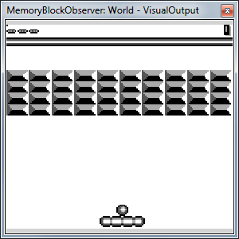
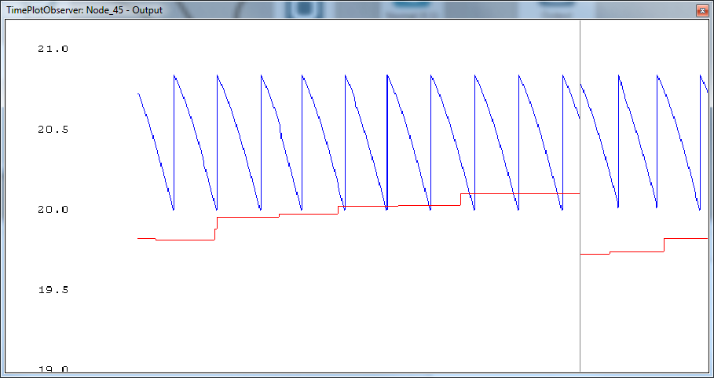
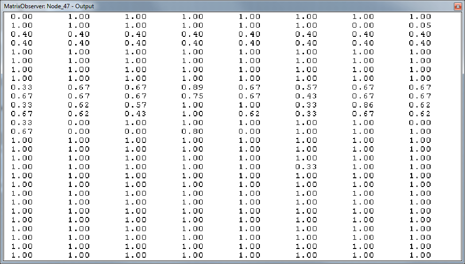
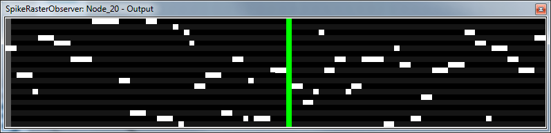
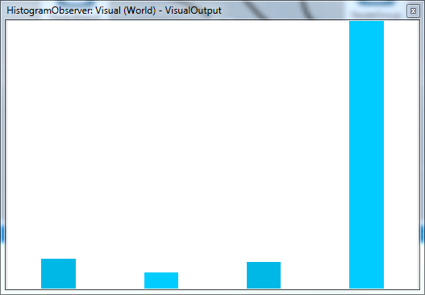

## Implemented Observers

###Common Parameters
* **Window | KeepRatio** - when true - keeps the correct ratio of x and y dimensions of the visualised data when the observer view is resized manually
* **Window | ViewMode** - changes the rendering type
    - **Fit_2D** - all the visualised data are stretched to occupy maximal space in the observer view
    - **Free_2D** - the visualised data are rendered with default scale, moving around the data is possible using the RMB, zooming with the mouse wheel pressed
    - **Orbit_3D** - the visualised data are rendered in 3D, rotation is possible using the RMB, zooming with the mouse wheel pressed
* **Texture | BilinearFiltering** - improves the quality of rendering - the pixels/sharp edges are smoothed out
* **Texture | TextureHeight,TextureWidth** - observer dimensions

###Standard Observer


Basic one. This is the default observer, which opens when you double-click the name of a memory block. Shows all values as a grid of rectangles, where each element corresponds to one colour coded value. All values below `MinValue` are considered "negative" in following description.

Settings:

* **Scale + Bounds**
    - **BoundPolicy** - `INHERITED` when `MinValue` and `MaxValue` are set by node itself, `MANUAL` otherwise
    - **MinValue, MaxValue** - expected minimal and maximal value; colours change according to this
    - **Scale** - Linear, InvTan
* **Texture**
    - **ColoringMethod**
        + **RedGreenScale** - negative values red, positive values green, infinity cyan, -infinity magenta, NaN blue
        + **GrayScale** - white to black
        + **ColorScale** - TODO
        + **BlackWhite** - black and white
        + **Vector** - TODO
        + **Raw** - TODO
        + **RGB** - TODO

###Plot Observer

Plots data as a curve in time.

Settings:

* **Rendering**
    - **BoundMax, BoundMin** - bounds of y-axis
    - **BoundPolicy**
		+ **AUTO** - the y-scale is derived dynamically during the simulation to best fit the actual data
		+ **INHERITED** - TODO
		+ **MANUAL** - the y-scale is set using the BoundMax, BoundMin values
    - **DisplayMethod**
		+ **CYCLE** - when the current data point comes to the end of the x-axis, the curve is being rendered from the start of x-axis again
		+ **SCALE** - the x-scale is automatically widened, when the current data point approaches the border of the observer view
		+ **SCROLL** - the x-axis view is scrolling together with the current data point
    - **ObserverHeight, ObserverWidth** - observer canvas dimensions ratio (when KeepRatio is True)
* **Sampling**
    - **Count** - how many values in mem. block to plot
    - **Offset** - offset from mem. block start when choosing values
    - **Delay, Period, Stride** - TODO
* **Visualization** - set colour of background, lines and font 

###Matrix Observer

Shows float values as a numbers in a grid

Settings:

* **Crop**
    - **XLength, XStart, YLength, YStart** - TODO: what is the behaviour?
* **Display**
    - **NbColumns** - number of grid columns
    - **NbDecimals** - number of decimals to show; the rest will be rounded down 

###Spike Observer


Shows values as spikes in time.

Settings:

* **Visualization**
    - **ColorBackgroundOne, ColorBackgroundTwo** - background colours (the background is striped)
    - **ColorColor** - colour of "spike" (appearance of non-zero value)
    - **ColorGrid** - colour of stripes
    - **ColorMarker** - colour of marker of the position in time
* **Colours - GRID_STEP** - TODO
* **Data**
    - **COUNT** - how many values to display
    - **OFFSET** - where in the memory block start
    - **X_SIZE** - width of graph

###Histogram Observer


Shows histogram of values

##Custom Observer Implementation

If a specific observer is needed for your node, you can implement one. The process is very similar to the task implementation except you will be deriving from the `MyNodeObserver<>` class.
``` csharp
public class MyTestObserver : MyNodeObserver<MyTestingNode>
{
  public MyTestObserver() //parameterless constructor
  {
    m_kernel = MyScheduler.Instance.KernelFactory.Kernel(“VisualizationKernel”);
    m_kernel.SetConstantVariable(“D_COLOR_FIRE”, 0xFFFFFC00);
    m_kernel.SetConstantVariable(“D_COLOR_DEAD”, 0xFFFFDDEE);
    m_kernel.SetConstantVariable(“D_COLOR_UNDEF”, 0xFF426639);
    m_kernel.SetConstantVariable(“D_N_AP_RESET”, 0xFF426639); //some global constants
  }

  protected override void Reset()
  {
    TextureWidth = Target.Output.ColumnHint;
    TextureHeight = Target.NeuronsCount / Target.Output.ColumnHint;
  }

  protected override void Execute()
  {
    m_kernel.SetupExecution(Target.NeuronsCount);

    m_kernel.Run(
      Target.Threshold,
      Target.ActionPotential,
      Target.NeuronLifePotential,
      Target.NeuronLastFired,
      VBODevicePointer,           //pixel memory you are going to write in
      Target.NeuronsCount
    );
  }
}
```
Practically, you will be implementing a kernel which transforms your node specific data into a set of pixels. Also notice this:

You need to override the `Execute()` method and the `Reset()` method. In `Execute()` you set and run your kernel. In `Reset()`, you set `TextureWidth` and `TextureHeight` parameters.

You should never call `Reset()` method directly. Instead, call `TriggerReset()` if you want the texture dimensions to be recalculated. `Reset()` will then be run automatically in next observer update (it's affected by the *Report Interval* described in [UI](ui.md#simulation-controls)).

Pass the **VBODevicePointer** to the kernel and write your pixel data into it.

Observers are run *after* the simulation step. Thanks to that, you don't have to e.g. *SafeCopyToHost* data if it's already there.

An OpenGL context associated with each observer is always located on the last installed GPU, and consequently, memory transfer may be needed every step. For this reason, try to limit data sent to the rendering kernel.
Finally, you need to register the observer to your node. Put one additional line into the `YourModule/conf/nodes.xml` file:

``` xml
<?xml version=”1.0″ encoding=”utf-8″ ?>
  <Configuration>
    <KnownNodes>
      <Node type=”YourModuleNamespace.Testing.MyNeuronsNode” CanBeAdded=”true” InputEnabled=”true” OutputEnabled=”true” BigIcon=”res\network_big.png” SmallIcon=”res\network.png”>
        <!– Add line like this –>
        <Observer type=”YourModuleNamespace.Testing.MyTestObserver”/>
      </Node>
      …
    </KnownNodes>
    …
  </Configuration>
```
After successful build, you should be able to add your observer through a menu located in the Node Property panel (see [UI](ui.md#node-toolbar)).