# UI Guide
We tried to keep the UI as simple as possible, you can see the basic controls of Brain Simulator on the following screen-shot.

<a href="img/main.png">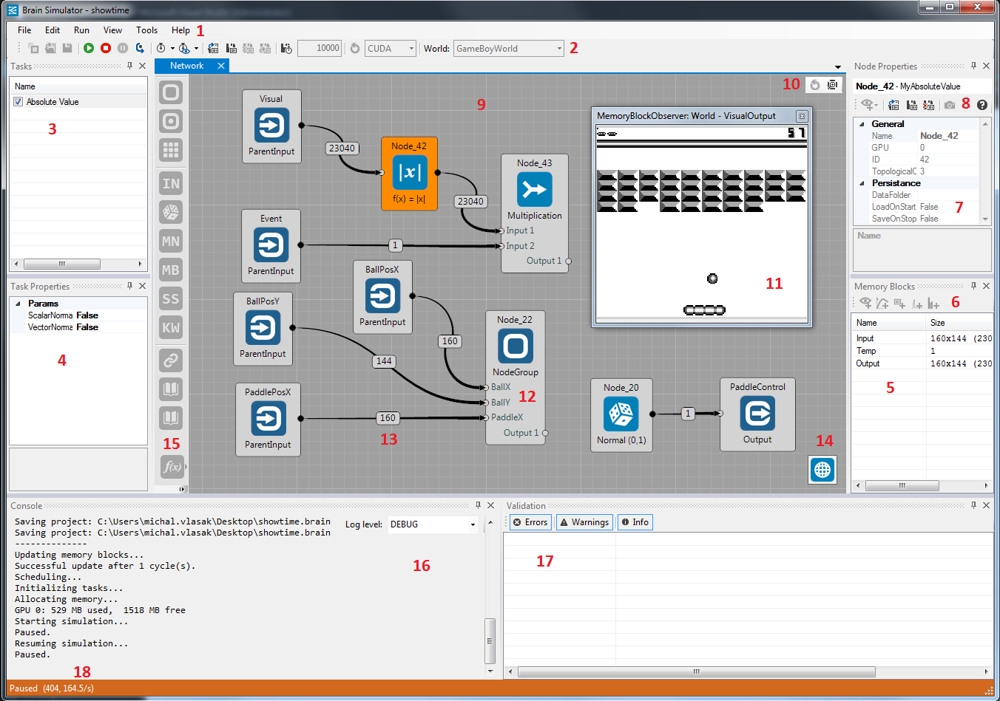</a>

1. [Menu toolbar](ui.md#menu-toolbar)
2. [Simulation controls](ui.md#simulation-controls)
3. [Node tasks](ui.md#node-tasks)
4. Task parameters
5. Node memory blocks
6. [Observer toolbar](ui.md#observer-toolbar)
7. Node/observer parameters
8. [Node toolbar](ui.md#node-toolbar)
9. Workspace
10. [Workspace controls](ui.md#workspace-controls)
11. Memory block observer window
12. Node group
13. Node connection - shows size of memory block connected
14. World
15. [Nodes toolbox](ui.md#nodes-toolbox)
16. Log window
17. Validator window
18. [Simulation run information](ui.md#simulation-info)

### <a name="menu-toolbar">Menu Toolbar</a>
#### File
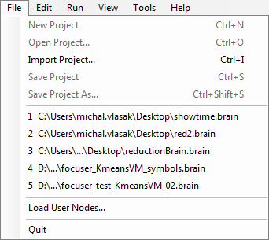

* **New Project, CTRL+N** - creates new project
* **Open Project..., CTRL+O** - open a project
* **Import Project..., CTRL+I** - add another project to current workspace
* **Save Project, CTRL+S** - save project
* **Save Project As..., CTRL+SHIFT+S** - save project with dialog
* List of recently opened projects
* **Load User Nodes** - load nodes from custom XML file
* **Set global data folder** - choose a custom location where global data will be saved
* **Quit** - quits Brain Simulator

#### Edit
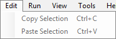

* **Copy Selection, CTRL+C** - copies currently selected nodes into clipboard
* **Paste Selection, CTRL+V** - paste nodes from clipboard into a workspace

It should be mentioned, that nodes are stored as XML text in a clipboard. Thanks to this, you can e.g. "paste" parts of different projects, just by copying corresponding part of their XML source file into a clipboard.

#### Run
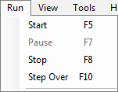

* **Start, F5** - starts or resumes the simulation
* **Pause, F7** - pauses the simulation
* **Stop, F8** - stops the simulation
* **Step Over, F10** - runs the simulation for 1 step
* **Step Into, F11** - in debug mode, steps into the current execution block
* **Step Out, Shift+F11** - in debug mode, steps out of the current execution block

#### View
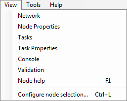

* **Network, Node Properties, Memory Blocks, Tasks, Task Properties, Console, Validation** - Opens various Brain Simulator windows (9, 7, 3, 4, 16, 17)
* **Dashboard Properties** - opens the [dashboard](ui.md#dashboard)
* **Node help, F1** - opens documentation for currently selected node
* **Debugging / Profiling** - opens the window with debugging and profiling information
* **Show/hide all observers, Ctrl+H** - shows or hides all observers; very useful when switching between brain editing and simulation debugging/observing memory blocks
* **Reset Views Layout, Ctrl+W** - Discards any custom window layout settings in Brain Simulator
* **Configure node selection..., Ctrl+L** - opens configuration window, where you can choose which nodes should be visible in the Nodes toolbox (15) and which Worlds in Simulation controls (2)

#### Tools
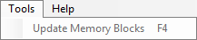

* **Update Memory Blocks, F4** - updates all memory blocks (this is automatically done when starting the simulation)

#### Help
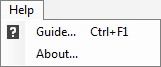

* **Guide..., CTRL+F1** - opens this documentation page

### <a name="simulation-controls">Simulation Controls</a>
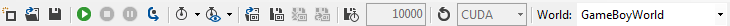

Some of these are just shortcuts for menu items. Left to right:

* **New/Open/Save Project**
* **Run/Stop/Pause Simulation**
* **Step Over**
* **Start debugging**
* **Enable profiling** - starts collecting information about the various tasks' execution duration and shows the results in the **Debugging / Profiling** window as well as the main graph view of the model
* **Sleep Interval** - after each simulation step, Brain Simulator sleeps for X ms; used for slowing down the simulation
* **Report Interval** - observers are rendered each X ms
*  **Global Load on Start** - toggle; all nodes that have their own persistence data files with the state load them on start of the simulation
*  **Global Save on Stop** - toggle; all nodes save their persistence data on simulation stop
*  **Clear Stored Network State**
*  **Export Stored Network State**
*  **Autosave During Simulation each X steps** - toggle; all nodes save their persistence data on simulation stop
*  **Reload CUDA Kernels** - reloads kernel .PTX files. Can be used for adding kernels to running instance of Brain Simulator
*  **World** - choose a world

### <a name="node-tasks">Node Tasks</a>

The list of tasks of the selected node, you can enable and disable the tasks execution here. This can be done during the simulation.

### <a name="observer-toolbar">Observer Toolbar</a>

You can add Standard, Plot, Matrix, Spike or Histogram observer to memory block here.

### <a name="node-toolbar">Node Toolbar</a>

Left to right:

* **Add Node Observer** - if node has any
* **Load Data on Startup** - toggle; loads node's specific state data on the simulation start
* **Save Data on Stop** - toggle; saves node's specific state data on the simulation stop
* **Autosave Snapshot** - save observer snapshot (as .PNG) to %userprofile%\Documents\bs_snapshots
* **Pin to Dashboard** - Pin the selected property to the Dashboard Properties
* **Help, F1** - opens the documentation for the selected node

### <a name="workspace-controls">Workspace Controls</a>

Left to right:

* **Update Memory Blocks** - calls `UpdateMemoryBlocks()` for all nodes. Updates the memory block sizes on connections.
* **Zoom To Fit** - makes all nodes in current node group visible in current viewport

### <a name="nodes-toolbox">Nodes Toolbox</a>
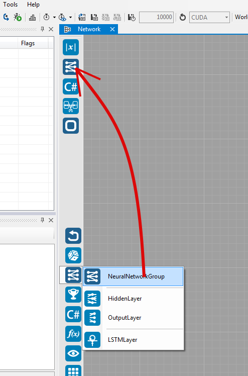

Use the **Configure node selection...** item in the **View** menu (or press **Ctrl+L**) to customize the contents of the nodes toolbox.

The nodes you select are added to the drop down menus according to their categories. If you use a node often, you can drag & drop it to the upper part of the toolbar for quicker access (as suggested by the picture above).  

### <a name="simulation-info">Simulation Info</a>

Left to right:

* **Simulation state** - Running/Paused/Design Mode
* **Current simulation step**
* **Speed of simulation** - in steps per second

### Dashboard
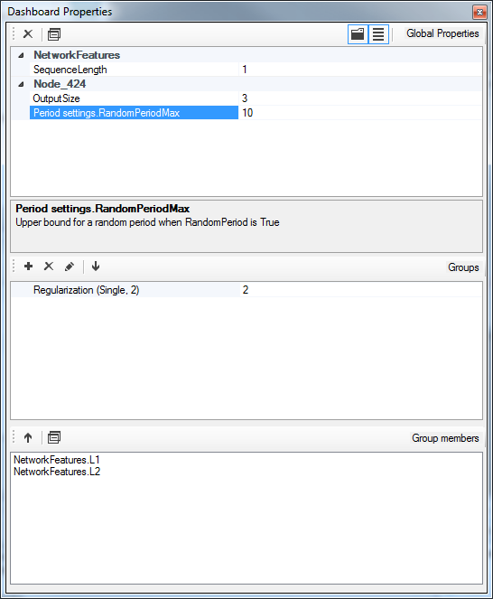

The dashboard is opened from the View menu. Task and node properties can be pinned to the dashboard, which allows for easy property manipulation from one place in the UI. Once pinned, the properties appear in the top property grid of the dashboard, grouped by node name. Task properties will display the name of the task as a prefix.

You can create groups for properties in the second window. The groups can have arbitrary name and properties can be added into them as long as they have the same type. The type of the group is set once the first property is added and is displayed next to its name together with the count of grouped properties. The list of properties in the selected group is in the bottommost part of the dashboard, from where the properties can be removed back into the non-grouped part of the dashboard. If you change the value of a property, all its member properties will have their values changed.

### Debugging / Profiling
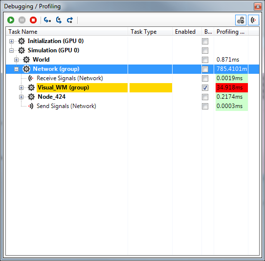

In this window, you can see the execution plan of your simulation. In **debug** mode, you can **step over, into and out** of single executables. You can also set breakpoints in **debug** mode. The simulation will then always run only up to the first encountered breakpoint.

Only **step over** will be available in normal mode and it will perform one step of the whole simulation.

If you turn on the **profiling** feature, you'll see times of the individual executables. When you select any non-leaf node of the execution tree, you'll see its direct siblings colored in either various shades of red according to the portions of time they take from the total time of the node, or in light green for those that take less than 5%.

### Node Group
Node group serves for joining multiple nodes into one topological object, which looks like just one node in the workspace. You can change number of I/O connections of the node group in its node parameters window (7).

To change the contents of the node group, double click on it, and you will see it expanded in the node group workspace. You can switch between multiple workspace windows with the tabs on the top border of the workspace window.

When you are inside a node group workspace, you can rename its I/O connections by clicking on them and changing their name in node parameter window. These names will be visible on the higher level too.

You can insert node groups into node groups how many times you want. You can copy/paste node groups as well.

### Conditional group
Conditional group serves for running a group of node only when a condition is met. The condition is transferred to a conditional group by means of signals.

Basically, you create a node which emits a signal, add it to your project and then choose the appropriate signal in the conditional group *Misc-Signal* attribute. Then, when the signal is raised, the content of the conditional group is ran.
